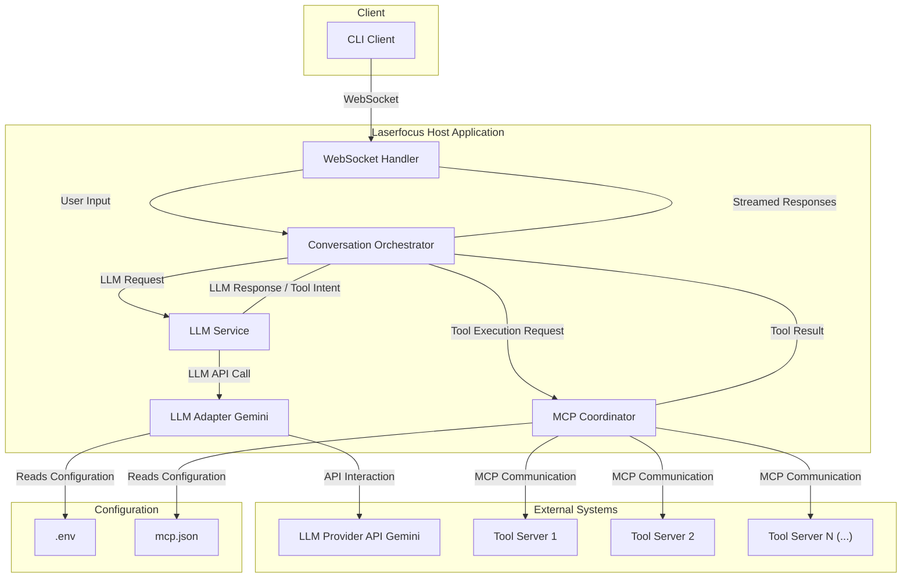

# Laserfocus Host Architecture

This document provides a high-level overview of the current architecture for the `laserfocus-host` Python application.

## Overview

The system acts as a host server that connects a WebSocket client (`cli_client.py`) to an LLM (Gemini). The LLM's capabilities are augmented by external tools made available via the Model Context Protocol (MCP). The core components coordinate conversation flow, LLM interaction, and tool execution.

## Architecture Diagram

## Core Components

- **Application Setup (`src/main.py`)**:
  - **This is the main entry point that initializes and coordinates the startup of all core services within the "Laserfocus Host Application" (Orchestrator, LLM Service, MCP Coordinator, WebSocket Handler, LLM Adapter).**
  - Loads configuration from `.env`.
  - Starts the WebSocket server via the `WebSocket Handler`.
- **WebSocket Handler (`src/handlers/websocket_handler.py`)**:
  - Manages WebSocket connections using the `websockets` library.
  - Assigns session IDs.
  - Receives JSON messages from clients (like the `CLI Client`).
  - Forwards user input to the `Conversation Orchestrator`.
  - Streams formatted responses (`text`, `status`, `error`) back to the client.
- **Conversation Orchestrator (`src/core/orchestrator.py`)**:
  - Manages conversation history per session.
  - Receives user input from the `WebSocket Handler`.
  - Interacts with `LLM Service` to get LLM responses or tool intents.
  - If a tool intent is received, calls `MCP Coordinator` to execute the tool.
  - Adds tool results to history and re-prompts the `LLM Service`.
  - Yields response parts back to the `WebSocket Handler`.
- **LLM Service (`src/core/llm_service.py`)**:
  - Abstracts LLM interaction logic.
  - Compiles system prompts, including base instructions and details about available tools (obtained from `MCP Coordinator`).
  - Uses an `LLM Adapter` (currently the Gemini implementation) to communicate with the LLM API.
  - Parses the raw LLM stream into structured parts (`TextChunk`, `ToolCallIntent`, `ErrorInfo`).
- **LLM Adapter (`src/core/gemini_adapter.py`)**:
  - Implements the protocol for a specific LLM Provider API (currently Google Gemini via `google-genai` SDK).
  - Formats conversation history for the API.
  - Handles streaming responses from the API.
  - Reads configuration (API Key) from `.env`.
- **MCP Coordinator (`src/core/mcp_coordinator.py`)**:
  - Reads tool server definitions from `mcp.json`.
  - Uses the `mcp` library (`mcp-sdk`) to connect to and manage background processes/connections for each tool server (via stdio/http).
  - Discovers available tools from each server (`tools/list`).
  - Provides a list of available `ToolDefinition`s to the `LLM Service`.
  - Executes requested tool calls (`call_tool`) on the appropriate server.
- **CLI Client (`src/cli_client.py`)**:
  - A command-line client that connects to the `WebSocket Handler`.
  - Uses `rich` for formatted output.
  - Sends user input and displays streamed server responses.
- **MCP Configuration (`mcp.json`)**:
  - Configuration file defining external tool servers, their transport (`stdio`/`http`), and how to run/connect to them.
- **Environment Configuration (`.env`)**:
  - Stores environment-specific configuration, primarily the `GEMINI_API_KEY`.

## Data Flow (Simplified)

1.  **User Input:** `CLI Client` sends user text via WebSocket.
2.  **Handling:** `WebSocket Handler` receives the message, gets/creates a session, and passes the text to the `Conversation Orchestrator`.
3.  **LLM Call:** `Conversation Orchestrator` adds input to history, gets tool info from `MCP Coordinator`, sends history + tools to `LLM Service`. `LLM Service` uses `LLM Adapter` to call the `LLM Provider API`.
4.  **LLM Response:** `LLM Adapter` streams response back through `LLM Service`. `LLM Service` parses it.
5.  **Text Output:** If text chunk, `Conversation Orchestrator` yields it to `WebSocket Handler` which sends it to `CLI Client`.
6.  **Tool Call:** If tool intent, `Conversation Orchestrator` yields status to `WebSocket Handler`, then calls `MCP Coordinator.call_tool`.
7.  **Tool Execution:** `MCP Coordinator` executes the tool on the correct external `Tool Server` via MCP.
8.  **Tool Result:** `MCP Coordinator` returns the result to `Conversation Orchestrator`.
