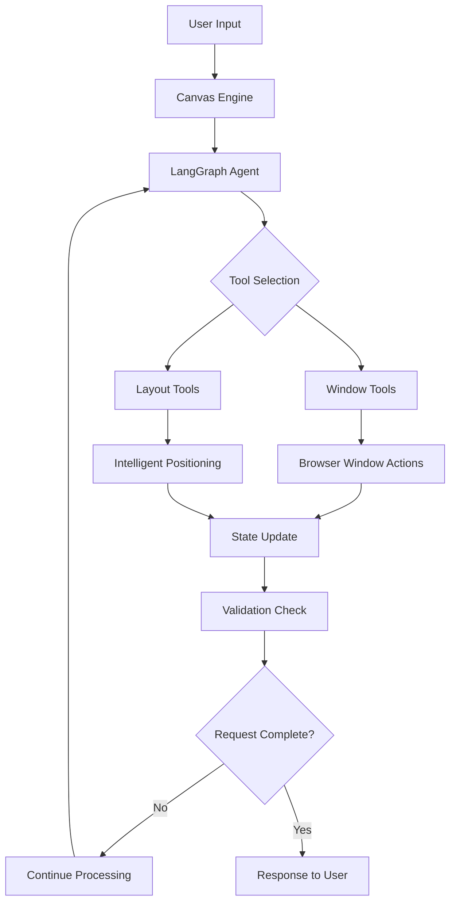

# LaserFocus: AI-Powered Window Management

## Overview

LaserFocus is an Electron-based desktop application that leverages an AI agent to intelligently manage browser windows. Users interact with the agent using natural language to request actions like opening specific URLs, arranging windows in sophisticated layouts, and closing windows. The application maintains persistent state and conversation history, ensuring a seamless and intelligent user experience.

## Key Features

### 🧠 **Intelligent Window Management**
- **Natural Language Interface**: "open google", "arrange side by side", "close all"
- **Smart Layout Engine**: Automatic top/bottom splits, grid layouts, and optimal space utilization
- **URL Normalization**: Automatically handles partial URLs (e.g., "google" → "https://google.com")
- **Context Awareness**: Remembers conversation history and current window states

### 🚀 **Advanced Canvas Engine**
- **Memory Leak Prevention**: Sophisticated AbortController lifecycle management
- **Action Sequence Validation**: Ensures multi-step operations complete fully
- **Concurrent Operation Support**: Handle multiple requests without interference
- **Intelligent Layout Strategies**: Adaptive window arrangements based on window count

### 🎯 **Modern Architecture**
- **LangGraph Integration**: Structured AI agent workflows with proper tool calling
- **TypeScript-First**: Full type safety throughout the codebase
- **Modular IPC System**: Clean separation between UI components and core engine
- **Hot Reload Development**: Fast iteration with Vite integration

## Quick Start

### Prerequisites
- **Node.js** (LTS version 18.x.x or later)
- **Yarn** (Classic or Berry)
- **Google AI API Key** (for Gemini integration)

### Installation

1. **Clone the repository:**
   ```bash
   git clone <repository-url>
   cd laserfocus
   ```

2. **Install dependencies:**
   ```bash
   yarn install
   ```

3. **Environment setup:**
   ```bash
   # Create .env file in project root
   echo "GOOGLE_API_KEY=your_api_key_here" > .env
   ```

4. **Run the application:**
   ```bash
   yarn dev
   ```

### Basic Usage Examples

```bash
# Open websites
"open google"
"open youtube and x.com"

# Open built-in apps
"open notes app"
"open calendar and arrange it side by side with notes"

# Intelligent layouts
"open reddit" # Auto-arranges in top/bottom split with existing windows

# Window management  
"close all"
"resize the google window"
"close the notes app"
```

## Core Architecture

### Canvas Engine (`src/core/engine/canvas-engine.ts`)

The Canvas Engine is the central orchestrator that manages the entire application lifecycle:

**Key Responsibilities:**
- **Window Lifecycle Management**: Creating, tracking, resizing, and closing browser windows
- **AI Agent Integration**: Hosts and invokes the LangGraph-based AI agent
- **State Persistence**: Maintains conversation history and window states across sessions
- **Tool Execution**: Provides tools for the agent to interact with the windowing system

**Advanced Features:**
- **Memory Management**: AbortController lifecycle prevents memory leaks
- **Request Validation**: Ensures all multi-step operations complete successfully
- **Layout Intelligence**: Automatic window arrangement strategies
- **Error Recovery**: Graceful handling of malformed requests and edge cases

```typescript
// Example Canvas Engine usage
const engine = new CanvasEngine(apiKey, modelName);
const result = await engine.invoke("open google and youtube side by side");
```

### LangGraph Agent Integration

The AI agent is built using LangGraph with a sophisticated workflow:



**Agent Workflow:**
1. **Input Processing**: Parse user intent and current canvas state
2. **Tool Selection**: Choose appropriate tools based on request type
3. **Execution**: Execute tools with proper error handling
4. **Validation**: Verify request completion (e.g., all windows opened/closed)
5. **Continuation**: Auto-continue if tasks are incomplete

### Tool System

**Core Tools:**
- `open_browser_window`: Create new browser windows with intelligent positioning
- `close_browser_window`: Close specific windows by ID  
- `resize_and_move_window`: Adjust window geometry and position
- `open_app_window` (future): Open built-in apps like Notes, Calendar, etc.

**Tool Schemas** (`src/core/engine/tools/`):
```typescript
// Example tool schema
export const openWindowSchema = z.object({
  url: z.string().describe("URL to open"),
  x: z.number().optional().describe("X position"),
  y: z.number().optional().describe("Y position"),
  width: z.number().optional().describe("Window width"),
  height: z.number().optional().describe("Window height")
});
```

### UI Components

**InputPill** (`src/apps/InputPill/`):
- Clean, minimal input interface for user queries
- Real-time feedback during agent processing
- Keyboard shortcuts and accessibility features

**AthenaWidget** (`src/apps/AthenaWidget/`):
- Displays conversation history and agent responses
- Real-time updates during multi-step operations
- Status indicators for ongoing processes

### Modern IPC Bridge (`src/core/bridge/`)

**Modular Architecture:**
- Each UI component defines its own IPC handlers via `AppIpcModule` interface
- Type-safe communication between processes using TypeScript
- Centralized coordination through `initializeBridge()` function

**Key Components:**
- `bridge.service.ts`: Central IPC coordination and modern `run-agent` handler
- `types.ts`: Type definitions for cross-process communication and `AppIpcModule` interface
- App-specific IPC modules: `InputPillIpcHandlers`, `AthenaWidgetIpcHandlers`

**Handler Registration Flow:**
```typescript
// Each app defines its IPC module
const appModules: AppIpcModule[] = [
  InputPillIpcHandlers,   // Handles InputPill-specific events
  AthenaWidgetIpcHandlers // Handles AthenaWidget-specific events
];

// Bridge service registers all handlers
initializeBridge(canvasEngine, appModules, appInstances);
```

## Layout Intelligence

### Automatic Layout Strategies

The Canvas Engine includes sophisticated layout algorithms:

**Single Window**: Full screen utilization (1070×776)

**Two Windows**: Side-by-side layout (530×776 each)

**Three+ Windows**: Intelligent top/bottom splits
- Top window: Full width, half height (1070×388)
- Bottom windows: Side-by-side in remaining space (530×388 each)

**Grid Layouts**: For 4+ windows, automatic grid arrangements

### Layout Configuration

```typescript
interface LayoutConfig {
  screenEdgePadding: number;    // 10px default
  windowGap: number;           // 10px spacing between windows
  menuBarHeight: number;       // 40px macOS menu bar
  minWindowWidth: number;      // 300px minimum
}
```

## Request Processing & Validation

### Request Type Detection

The system intelligently categorizes user requests:

```typescript
type RequestType = 
  | 'open'           // "open google"
  | 'close_all'      // "close all"
  | 'close_specific' // "close youtube"
  | 'other';         // resize, move, etc.
```

### Action Sequence Validation

**Problem Solved**: Previously, multi-step operations would sometimes complete partially (e.g., resize windows but forget to open the requested new window).

**Solution**: Programmatic validation ensures complete task execution:

```typescript
// Example validation flow
if (!this.isRequestFulfilled(userInput, initialWindowCount)) {
  // Auto-continue with follow-up prompt
  const followUpMessage = "Complete the task by opening the requested window.";
  await this.graph.invoke(continueState);
}
```

## Memory Management

### AbortController Lifecycle

**Challenge**: LangGraph operations create AbortSignal listeners that could accumulate and cause memory leaks.

**Solution**: Sophisticated controller management:

```typescript
// Per-operation controllers
private createAbortController(): AbortController {
  const controller = new AbortController();
  this.activeControllers.add(controller);
  
  // Auto-cleanup on completion
  controller.signal.addEventListener('abort', () => {
    this.activeControllers.delete(controller);
  });
  
  return controller;
}
```

**Benefits**:
- No memory leaks in long-running sessions
- Concurrent operations don't interfere
- Graceful cleanup on engine destruction

## Error Handling & Recovery

### URL Normalization

```typescript
private normalizeUrl(url: string): string {
  if (url.startsWith('http://') || url.startsWith('https://')) {
    return url;
  }
  return `https://${url}`;
}
```

### Malformed Request Recovery

- **Schema Validation**: Zod schemas ensure tool arguments are well-formed
- **Fallback Prompts**: When external prompt files fail to load
- **Graceful Degradation**: Continue operation even with partial failures

## App Architecture & Development

### Standalone App Development (`src/apps/`)

LaserFocus provides a powerful architecture for developing standalone applications that can be managed by the Canvas Engine. Each app in `src/apps/` is a complete, self-contained application with its own UI, logic, and build configuration.

#### App Structure Pattern

Each app follows a consistent structure that enables easy development and integration:

```
src/apps/YourApp/
├── index.html          # Entry point HTML
├── renderer.ts         # Client-side logic (can be React, Vue, vanilla JS/TS)
├── style.css           # App-specific styles
├── preload.ts          # Secure bridge between main and renderer
├── your-app.main.ts    # Main process window management
└── your-app.ipc.ts     # IPC handlers (implements AppIpcModule)
```

#### Real Example: Notes App Implementation

Here's how you would implement a Notes app that the Canvas Engine can open and manage:

**1. Create App Structure:**
```bash
mkdir src/apps/Notes
```

**2. Main Process Controller (`notes.main.ts`):**
```typescript
export class NotesWindow {
  public window: BrowserWindow;
  private viteDevServerUrl: string | undefined;
  private preloadPath: string;

  constructor(primaryDisplay: Display, viteDevServerUrl: string | undefined, preloadPath: string) {
    this.viteDevServerUrl = viteDevServerUrl;
    this.preloadPath = preloadPath;
    this.window = new BrowserWindow({
      width: 800,
      height: 600,
      title: 'Notes App',
      webPreferences: {
        preload: this.preloadPath,
        nodeIntegration: false,
        contextIsolation: true,
      },
    });
  }

  init(): void {
    if (this.viteDevServerUrl) {
      // Development: Load from Vite dev server
      this.window.loadURL(`${this.viteDevServerUrl}/src/apps/Notes/index.html`);
    } else {
      // Production: Load from built files
      const rendererPath = path.join(app.getAppPath(), 'dist/apps/Notes/index.html');
      this.window.loadFile(rendererPath);
    }
  }
}
```

**3. React App Entry (`index.html`):**
```html
<!DOCTYPE html>
<html>
<head>
    <meta charset="UTF-8">
    <title>Notes App</title>
    <link rel="stylesheet" href="/src/apps/Notes/style.css">
</head>
<body>
    <div id="notes-root"></div>
    <script type="module" src="/src/apps/Notes/renderer.tsx"></script>
</body>
</html>
```

**4. React Renderer (`renderer.tsx`):**
```typescript
import React from 'react';
import ReactDOM from 'react-dom/client';
import { NotesApp } from './components/NotesApp';

const root = ReactDOM.createRoot(
  document.getElementById('notes-root') as HTMLElement
);

root.render(<NotesApp />);
```

**5. IPC Module (`notes.ipc.ts`):**
```typescript
export const NotesIpcHandlers: AppIpcModule = {
  moduleId: 'notes',
  registerMainProcessHandlers: (ipcMain, canvasEngine, appInstance) => {
    ipcMain.on('notes:save-note', (event, noteData) => {
      // Handle note saving logic
    });
    
    ipcMain.on('notes:load-notes', (event) => {
      // Handle note loading logic
    });
  }
};
```

#### Build System Integration

The Vite configuration automatically handles app building. Add your app to `vite.config.ts`:

```typescript
export default defineConfig({
  plugins: [
    electron([
      // ... existing entries ...
      {
        entry: 'src/apps/Notes/preload.ts',
        vite: {
          build: {
            outDir: 'dist/apps/Notes',
          },
        },
      },
    ]),
  ],
  build: {
    rollupOptions: {
      input: {
        // ... existing entries ...
        notes: path.resolve(__dirname, 'src/apps/Notes/index.html'),
      },
    },
  },
});
```

#### Canvas Engine Integration

Once your app is built, the Canvas Engine can open it as a managed window:

```typescript
// User says: "open notes app"
// Canvas Engine can open the Notes app with:

const notesWindow = new BrowserWindow({
  // ... configuration ...
});

// Development
notesWindow.loadURL(`${VITE_DEV_SERVER_URL}/src/apps/Notes/index.html`);

// Production  
notesWindow.loadFile('dist/apps/Notes/index.html');
```

#### Advanced App Capabilities

**State Management:**
- Apps can use any state management solution (Redux, Zustand, Context API)
- Persist data through IPC to main process or local storage
- Share state between Canvas Engine and app through IPC events

**Full React Ecosystem:**
- Use React Router for multi-page apps
- Integrate UI libraries (Material-UI, Chakra UI, etc.)
- Hot reload during development via Vite
- TypeScript support out of the box

**Data Integration:**
- Apps can make API calls to external services
- SQLite integration for local data storage
- Real-time updates through WebSocket connections
- File system access through main process IPC

**UI Frameworks Supported:**
- **React**: Full JSX/TSX support with hot reload
- **Vue**: Vue 3 with Composition API
- **Svelte**: Modern reactive framework
- **Vanilla**: Pure TypeScript/JavaScript with DOM manipulation

#### App Registration in Main Process

Register your app in `src/main.ts`:

```typescript
// Import your app
import { NotesWindow } from './apps/Notes/notes.main';
import NotesIpcHandlers from './apps/Notes/notes.ipc';

// Initialize in initializeApp()
const notesApp = new NotesWindow(primaryDisplay, VITE_DEV_SERVER_URL, 
  path.join(__dirname, '../apps/Notes/preload.js'));
notesApp.init();

// Add to app instances and modules
appInstances.set('notes', notesApp);
appModules.push(NotesIpcHandlers);
```

This architecture enables you to build sophisticated desktop applications that seamlessly integrate with LaserFocus's AI-powered window management system.

#### Future Canvas Engine Integration

The Canvas Engine will soon support dynamic app opening through natural language commands. Users will be able to say:

- **"open notes app"** → Canvas Engine opens the Notes app window
- **"open calendar and place it next to notes"** → Opens Calendar app with intelligent positioning  
- **"close all apps but keep notes"** → Selective app management
- **"resize the notes app to take up the left half"** → Dynamic app window manipulation

This creates a unified ecosystem where web content and native apps coexist under intelligent AI management.

## Development

### Project Structure

```
src/
├── apps/                    # UI Components
│   ├── InputPill/          # User input interface
│   └── AthenaWidget/       # Conversation display
├── core/                   # Core engine and services
│   ├── bridge/             # IPC communication
│   ├── config/             # Application configuration
│   └── engine/             # Canvas Engine implementation
│       ├── canvas-engine.ts # Main engine
│       ├── engine.service.ts # Engine management
│       ├── prompts/        # AI prompt templates
│       └── tools/          # Tool schemas
├── utils/                  # Shared utilities
└── main.ts                 # Electron main process
```

### Development Workflow

```bash
# Start development server
yarn dev

# Run tests (when available)
yarn test

# Build for production
yarn build

# Type checking
yarn type-check
```

### Adding New Tools

1. **Define Schema** (`src/core/engine/tools/`):
```typescript
export const newToolSchema = z.object({
  param1: z.string(),
  param2: z.number().optional()
});
```

2. **Implement Tool** (in `CanvasEngine`):
```typescript
const newTool = tool(
  async (args: z.infer<typeof newToolSchema>) => {
    // Implementation
    return result;
  },
  {
    name: "new_tool",
    description: "Tool description for AI",
    schema: newToolSchema
  }
);
```

3. **Register Tool**:
```typescript
this.tools = [newTool, ...existingTools];
```

## Environment Variables

Create a `.env` file in the project root:

```env
# Required
GOOGLE_API_KEY=your_google_ai_api_key

# Development (optional)
VITE_DEV_SERVER_URL=http://localhost:5173
NODE_ENV=development

# Canvas Engine (optional)
DEFAULT_MODEL_NAME=gemini-1.5-flash
```

## Troubleshooting

### Common Issues

**Memory Warnings**:
- Fixed in current version with proper AbortController management
- If you see warnings, ensure you're using the latest Canvas Engine

**Windows Not Opening**:
- Check GOOGLE_API_KEY is valid
- Verify network connectivity
- Check console for URL normalization issues

**Layout Issues**:
- Layout engine adapts to screen size automatically
- Check screen resolution and available space
- Verify window bounds are within screen limits

**Tool Execution Failures**:
- Schema validation prevents most issues
- Check tool arguments in logs
- Verify Electron permissions

### Debug Mode

Enable verbose logging:
```bash
DEBUG=canvas-engine yarn dev
```

## Contributing

1. **Code Style**: Follow TypeScript best practices
2. **Testing**: Add tests for new features
3. **Documentation**: Update README for significant changes
4. **Type Safety**: Maintain full TypeScript coverage

## License

[Add your license information here]

## Acknowledgments

- **LangGraph**: For AI agent workflow management
- **Google AI**: For Gemini language model integration
- **Electron**: For cross-platform desktop application framework
- **Vite**: For fast development experience
