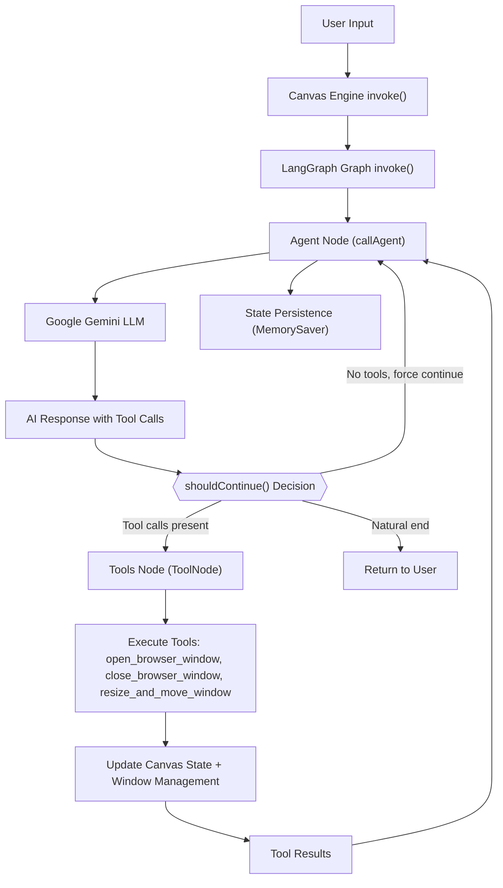

# LaserFocus: AI-Powered Window Management

## Overview

LaserFocus is an Electron-based desktop application that leverages an AI agent to intelligently manage browser windows. Users interact with the agent using natural language to request actions like opening specific URLs, arranging windows in sophisticated layouts, and closing windows. The application maintains persistent state and conversation history, ensuring a seamless and intelligent user experience.

✅ **Status**: Fully functional with optimized performance and memory management

## Key Features

### 🧠 **Intelligent Window Management**
- **Natural Language Interface**: "open google", "arrange side by side", "close all"
- **Smart Layout Engine**: Automatic top/bottom splits, grid layouts, and optimal space utilization
- **URL Normalization**: Automatically handles partial URLs (e.g., "google" → "https://google.com")
- **Context Awareness**: Remembers conversation history and current window states

### 🚀 **Advanced Canvas Engine**
- **Memory Leak Prevention**: Sophisticated AbortController lifecycle management with EventTarget optimization
- **Action Sequence Validation**: Ensures multi-step operations complete fully
- **Concurrent Operation Support**: Handle multiple requests without interference  
- **Intelligent Layout Strategies**: Adaptive window arrangements based on window count
- **Performance Optimized**: Streamlined workflow with eliminated redundant operations

### 🎯 **Modern Architecture**
- **LangGraph Integration**: Structured AI agent workflows with proper tool calling
- **TypeScript-First**: Full type safety throughout the codebase
- **Modular IPC System**: Clean separation between UI components and core engine
- **Hot Reload Development**: Fast iteration with Vite integration

## Quick Start

### Prerequisites
- **Node.js** (LTS version 18.x.x or later)
- **Yarn** (Classic or Berry)
- **Google AI API Key** (for Gemini integration)

### Installation

1. **Clone the repository:**
   ```bash
   git clone <repository-url>
   cd laserfocus
   ```

2. **Install dependencies:**
   ```bash
   yarn install
   ```

3. **Environment setup for development:**
   ```bash
   # Copy the example file and add your API key
   cp .env.example .env
   # Then edit .env and add your Google AI API key
   ```

4. **Run the application:**
   ```bash
   # Development mode (uses .env file automatically)
   yarn dev
   
   # Production build
   yarn start
   ```

### Development Environment

**🔧 Automatic Environment Loading**

LaserFocus automatically loads configuration from `.env` files in development mode:

- **✅ API Keys**: Automatically loaded from `GOOGLE_API_KEY`, `OPENAI_API_KEY`, or `ANTHROPIC_API_KEY`
- **✅ Provider Settings**: Override config with `PROVIDER_SERVICE`, `PROVIDER_MODEL`, etc.
- **✅ Smart Detection**: Uses the first available API key found in environment variables

**Environment Variables:**
```bash
# Primary API Key (choose one)
GOOGLE_API_KEY=your-google-ai-api-key
OPENAI_API_KEY=your-openai-api-key  
ANTHROPIC_API_KEY=your-anthropic-api-key

# Provider Configuration (optional overrides)
PROVIDER_SERVICE=google                    # google, openai, anthropic, ollama
PROVIDER_MODEL=gemini-2.0-flash-lite      # Model name for your provider
PROVIDER_TEMPERATURE=0.2                   # Creativity level (0-2)
PROVIDER_MAX_TOKENS=2048                   # Max response length

# Development Settings
NODE_ENV=development
LOG_LEVEL=debug                            # Override environment default (debug, info, warn, error)
```

**Quick Setup:**
```bash
cp .env.example .env
# Edit .env and add your API key
```
This approach:
1. Uses the standard `.env.example` pattern
2. Simple copy and edit workflow
3. All available options clearly documented
4. No interactive prompts needed

**No Environment Setup Required:**
- Production builds use the built-in configuration UI
- Settings are saved securely with encrypted API keys
- Environment variables only override config in development mode

### Basic Usage Examples

```bash
# Open websites
"open google"
"open x"          # Opens x.com with intelligent side-by-side layout
"open youtube"    # Auto-arranges in 3-window top/bottom split

# Batch operations
"open youtube and x.com"

# Window management  
"close all windows"    # Systematically closes all browser windows
"resize the google window"
"close the notes app"

# Built-in apps (✅ Available Now)
"open notes app"              # Opens the notes app
"open reminders app"          # Opens the reminders app
"open notes and arrange it side by side with reminders"
```

## Core Architecture

⚠️ **Important**: The current implementation contains temporary workarounds for Google Gemini's schema adherence issues. See [`GEMINI_WORKAROUNDS.md`](./GEMINI_WORKAROUNDS.md) for detailed documentation on technical debt that should be removed when migrating to better LLM providers.

### Canvas Engine (`src/core/engine/canvas-engine.ts`)

The Canvas Engine is the central orchestrator that manages the entire application lifecycle:

**Key Responsibilities:**
- **Window Lifecycle Management**: Creating, tracking, resizing, and closing browser windows
- **AI Agent Integration**: Hosts and invokes the LangGraph-based AI agent
- **State Persistence**: Maintains conversation history and window states across sessions
- **Tool Execution**: Provides tools for the agent to interact with the windowing system
- **Platform Component Management**: Tracks and manages built-in UI components and apps
- **UI Discovery Service**: Automatically discovers and registers available components

**Advanced Features:**
- **Memory Management**: AbortController lifecycle prevents memory leaks
- **Request Validation**: Ensures all multi-step operations complete successfully
- **Layout Intelligence**: Automatic window arrangement strategies with critical compliance rules
- **Error Recovery**: Graceful handling of malformed requests and edge cases
- **UI Component Integration**: Seamless management of platform components like InputPill and AthenaWidget
- **Architectural Evolution**: Three-phase roadmap for progressive enhancement

**Architectural Evolution Roadmap:**

**Phase 1 (Current)**: Foundation & Discovery
- ✅ UI Discovery Service integration
- ✅ Platform component tracking (InputPill, AthenaWidget)
- ✅ Basic component registration and lifecycle management

**Phase 2 (In Progress)**: AI-Driven UI Management
- 🔄 Natural language UI component control
- 🔄 Dynamic component positioning and resizing
- 🔄 Context-aware component interactions

**Phase 3 (Future)**: Advanced Integration
- 🔮 Cross-component state synchronization
- 🔮 Intelligent workspace orchestration
- 🔮 Adaptive UI layouts based on user behavior

```typescript
// Example Canvas Engine usage
const engine = new CanvasEngine(apiKey, modelName);
const result = await engine.invoke("open google and youtube side by side");
```

### LangGraph Agent Integration

The AI agent is built using LangGraph with a sophisticated workflow:



**Agent Workflow:**
1. **Input Processing**: User input becomes HumanMessage in LangGraph thread
2. **Agent Node**: Builds system prompt with current canvas state and calls Google Gemini LLM
3. **Decision Logic**: `shouldContinue()` routes based on AI response:
   - Tool calls present → execute tools
   - No tool calls but recent tool execution → natural end
   - No tool calls, force continuation (max 2 attempts) → retry agent
4. **Tool Execution**: Execute one of three window management tools with state updates
5. **Persistence**: MemorySaver maintains conversation history across sessions

### Tool System

**Core Tools:**
- `open_browser_window`: Create new browser windows, platform components, or apps via URL schemes
- `close_browser_window`: Close specific windows by ID  
- `resize_and_move_window`: Adjust window geometry and position

**URL Schemes for Different Window Types:**
- `https://...` - Standard browser windows
- `platform://ComponentName` - Platform UI components (InputPill, AthenaWidget)
- `apps://AppName` - Built-in applications (notes, reminders)
- `widgets://WidgetName` - Widget components (future)

**Tool Schemas** (`src/core/engine/tools/canvas-tool-schemas.ts`):
```typescript
export const openWindowSchema = z.object({
  url: z.string().describe("URL to open or component scheme"),
  x: z.number().optional().describe("X position"),
  y: z.number().optional().describe("Y position"),
  width: z.number().optional().describe("Window width"),
  height: z.number().optional().describe("Window height"),
  title: z.string().optional().describe("Window title")
});

export const resizeAndMoveWindowSchema = z.object({
  windowId: z.string().describe("REQUIRED: The ID of the window to resize/move"),
  x: z.number().optional().describe("New X coordinate"),
  y: z.number().optional().describe("New Y coordinate"),
  width: z.number().optional().describe("New width"),
  height: z.number().optional().describe("New height")
});
```

### UI Components

**InputPill** (`src/apps/InputPill/`):
- Clean, minimal input interface for user queries
- Real-time feedback during agent processing
- Keyboard shortcuts and accessibility features

**AthenaWidget** (`src/apps/AthenaWidget/`):
- Displays conversation history and agent responses
- Real-time updates during multi-step operations
- Status indicators for ongoing processes

### Modern IPC Bridge (`src/core/bridge/`)

**Enhanced Modular Architecture:**
- Each UI component defines its own IPC handlers via `AppIpcModule` interface
- Type-safe communication between processes using TypeScript
- Centralized coordination through `initializeBridge()` function
- **Conversation Monitoring**: AthenaWidget tracks all agent interactions in real-time

**Key Components:**
- `bridge.service.ts`: Central IPC coordination with enhanced `run-agent` handler
- `types.ts`: Type definitions for cross-process communication and `AppIpcModule` interface
- App-specific IPC modules: `InputPillIpcHandlers`, `AthenaWidgetIpcHandlers`, `notesIpcHandlers`, `remindersIpcHandlers`

**Enhanced Agent Communication Flow:**
```typescript
// Modern 'run-agent' handler with conversation monitoring
ipcMain.handle('run-agent', async (event, userQuery: string) => {
  try {
    // 1. Send user query to AthenaWidget for monitoring
    if (appInstances.has('athena')) {
      const athenaWindow = appInstances.get('athena');
      athenaWindow?.window?.webContents?.send('user-query', userQuery);
    }

    // 2. Process with Canvas Engine
    const result = await canvasEngine.invoke(userQuery);
    
    // 3. Handle empty responses gracefully
    const isEmptyResponse = !result || 
      result.trim() === '' || 
      result.trim() === 'undefined';
    
    const finalResult = isEmptyResponse ? '✓ Task completed' : result;

    // 4. Send response to both requester and AthenaWidget
    if (appInstances.has('athena')) {
      const athenaWindow = appInstances.get('athena');
      athenaWindow?.window?.webContents?.send('agent-response', finalResult);
    }

    return finalResult;
  } catch (error) {
    // Error handling with monitoring
    const errorMessage = `Error: ${error instanceof Error ? error.message : 'Unknown error'}`;
    
    if (appInstances.has('athena')) {
      const athenaWindow = appInstances.get('athena');
      athenaWindow?.window?.webContents?.send('agent-error', errorMessage);
    }
    
    throw error;
  }
});
```

**Handler Registration Flow:**
```typescript
// Each app defines its IPC module
const appModules: AppIpcModule[] = [
  InputPillIpcHandlers,    // Handles InputPill-specific events
  AthenaWidgetIpcHandlers, // Handles AthenaWidget conversation monitoring
  notesIpcHandlers,        // Handles notes app interactions
  remindersIpcHandlers     // Handles reminders app interactions
];

// Bridge service registers all handlers with Canvas Engine integration
initializeBridge(canvasEngine, appModules, appInstances);
```

**Conversation Monitoring Features:**
- **Real-time Updates**: AthenaWidget receives all user queries and agent responses
- **Error Tracking**: Failed operations are displayed with context
- **Empty Response Handling**: Meaningless responses are converted to completion markers
- **Multi-window Support**: All platform components participate in conversation flow

## Layout Intelligence

### Critical Window Layout Strategy Guidelines

**⚠️ MANDATORY COMPLIANCE RULES:**
1. **NEVER position windows at x=0** - Always respect screenEdgePadding
2. **NEVER create overlapping windows** - Each window must have unique, non-overlapping bounds
3. **ALWAYS maintain proper gaps** - Use consistent windowGap spacing between windows
4. **ALWAYS account for menu bar** - Factor in menuBarHeight for y-positioning

### Automatic Layout Strategies

The Canvas Engine includes sophisticated layout algorithms with strict compliance enforcement:

**Single Window**: Full screen utilization (1070×776)
- Position: x=10, y=50, width=1070, height=776
- Respects all padding and menu bar constraints

**Two Windows**: Side-by-side layout (530×776 each)
- Left: x=10, y=50, width=530, height=776
- Right: x=550, y=50, width=530, height=776
- Maintains 10px gap between windows

**Three+ Windows**: Intelligent top/bottom splits
- Top window: x=10, y=50, width=1070, height=378
- Bottom left: x=10, y=438, width=530, height=378  
- Bottom right: x=550, y=438, width=530, height=378
- Vertical gap of 10px between top and bottom rows

**Grid Layouts**: For 4+ windows, automatic grid arrangements
- Calculates optimal rows/columns based on window count
- Maintains consistent gaps and proportional sizing

### Layout Decision Tree

**Adding Second Window (Critical Implementation)**:
```
User Content Windows = 1 → Apply Side-by-Side Strategy
├── Existing window bounds: get current position/size
├── Calculate left position: x=10, width=530
├── Calculate right position: x=550, width=530
├── Move existing window to left position
└── Create new window at right position
```

**For 3+ Windows**:
```
User Content Windows ≥ 3 → Apply Top/Bottom Split Strategy
├── Top: Single window, full width, half height
├── Bottom: Remaining windows in side-by-side arrangement
└── Maintain consistent gaps throughout
```

### Layout Configuration

```typescript
interface LayoutConfig {
  screenEdgePadding: number;    // 10px default - CRITICAL: never use x=0
  windowGap: number;           // 10px spacing between windows
  menuBarHeight: number;       // 40px macOS menu bar
  minWindowWidth: number;      // 300px minimum
  screenWidth: number;         // 1090px available space
  screenHeight: number;        // 826px available space
}

// New Canvas Engine Type Definitions
interface CanvasWindowState {
  id: string;
  bounds: { x: number; y: number; width: number; height: number };
  url?: string;
  title?: string;
  isVisible: boolean;
  type: 'browser' | 'app' | 'platform';
}

interface CanvasState {
  windows: Map<string, CanvasWindowState>;
  platformComponents: Map<string, UIComponentBounds>;
  layoutConfig: LayoutConfig;
  conversationHistory: Array<{ role: 'user' | 'assistant'; content: string }>;
}

interface UIComponentBounds {
  x: number;
  y: number;
  width: number;
  height: number;
  isVisible: boolean;
  componentId: string;
}

interface LLMConfig {
  modelName: string;
  apiKey: string;
  temperature?: number;
  maxTokens?: number;
}
```

### Window Positioning Validation

Every window position is validated against:
- **Boundary Checks**: Ensure x ≥ screenEdgePadding, y ≥ menuBarHeight
- **Overlap Detection**: Verify no two windows share the same bounds
- **Size Constraints**: Enforce minimum width/height requirements
- **Gap Compliance**: Validate proper spacing between adjacent windows

## Memory Management

### AbortController Lifecycle & EventTarget Optimization

**Challenge**: LangGraph operations create AbortSignal listeners that could accumulate and cause memory leaks, especially during complex multi-window operations that require multiple LLM calls.

**Solution**: Comprehensive memory management approach:

```typescript
// EventTarget listener limit optimization
setMaxListeners(50); // Handles complex multi-window operations

// Per-operation controller cleanup
const abortController = new AbortController();
const timeoutId = setTimeout(() => abortController.abort(), 30000);

try {
  // Operation with proper AbortSignal integration
  const response = await model.invoke(messages, { signal: abortController.signal });
} finally {
  // Always clean up resources
  clearTimeout(timeoutId);
  if (!abortController.signal.aborted) {
    abortController.abort();
  }
}
```

**Benefits**:
- ✅ **No memory leaks** in long-running sessions with complex operations
- ✅ **No MaxListenersExceededWarning** during multi-window workflows
- ✅ **Concurrent operations** don't interfere with each other
- ✅ **Graceful cleanup** on engine destruction

## Error Handling & Recovery

### URL Normalization

```typescript
private normalizeUrl(url: string): string {
  if (url.startsWith('http://') || url.startsWith('https://')) {
    return url;
  }
  return `https://${url}`;
}
```

### Malformed Request Recovery

- **Schema Validation**: Zod schemas ensure tool arguments are well-formed
- **Fallback Prompts**: When external prompt files fail to load
- **Graceful Degradation**: Continue operation even with partial failures

## App Architecture & Development

### Standalone App Development (`src/apps/`)

LaserFocus provides a powerful architecture for developing standalone applications that can be managed by the Canvas Engine. Each app in `src/apps/` is a complete, self-contained application with its own UI, logic, and build configuration.

#### Standardized App Structure Pattern

Each app follows a **strict, standardized structure** that enables seamless Canvas Engine integration and automatic discovery:

```
src/ui/apps/your-app/           # Lowercase, kebab-case directory name
├── src/                        # Source files subdirectory
│   ├── index.html             # Entry point HTML
│   ├── renderer.tsx           # React renderer (TypeScript)
│   ├── style.css              # App-specific styles
│   ├── preload.ts             # Secure IPC bridge
│   └── components/            # React components
│       └── YourAppComponent.tsx
├── your-app.main.ts           # Main process window controller
└── your-app.ipc.ts            # IPC handlers (AppIpcModule)
```

**📋 Naming Conventions (Auto-Generated by AppGenerator):**
- **Directory**: `kebab-case` (`notes`, `reminders`, `task-manager`)
- **Classes**: `PascalCase` (`NotesWindow`, `RemindersApp`)
- **IPC Modules**: `camelCase` + `PascalCase` (`notesIpcHandlers`, `RemindersIpcHandlers`)
- **API Objects**: `camelCase` (`notesAPI`, `remindersAPI`)

**🔧 AppGenerator Tool:**
LaserFocus includes an `AppGenerator` utility that automatically creates apps with:
- ✅ Consistent case conversion (PascalCase, camelCase, kebab-case)
- ✅ Standardized file structure and boilerplate
- ✅ Proper TypeScript types and IPC interfaces
- ✅ Automatic Vite configuration integration

#### Real Example: Notes & Reminders Apps (Current Implementation)

**✅ Live Examples:** The repository includes two fully implemented apps demonstrating the standardized pattern:

**Notes App (`src/ui/apps/notes/`):**
```typescript
// notes.main.ts - Main process window controller
export class NotesWindow {
  public window: BrowserWindow;
  
  constructor(primaryDisplay: Display, viteDevServerUrl: string | undefined, preloadPath: string) {
    this.window = new BrowserWindow({
      width: 800, height: 600,
      title: 'notes',  // Lowercase title
      webPreferences: {
        preload: preloadPath,
        nodeIntegration: false,
        contextIsolation: true,
      },
    });
  }

  init(): void {
    if (this.viteDevServerUrl) {
      // Development: Load from Vite dev server  
      this.window.loadURL(`${this.viteDevServerUrl}/src/ui/apps/notes/src/index.html`);
    } else {
      // Production: Load from built files
      this.window.loadFile('dist/apps/notes/index.html');
    }
  }

  focus(): void { this.window.focus(); }
  close(): void { this.window.close(); }
}
```

**Preload Bridge (`notes/src/preload.ts`):**
```typescript
import { contextBridge, ipcRenderer } from 'electron';

interface notesAPI {
  exampleAction: () => Promise<string>;
  focusWindow: () => Promise<void>;
}

const notesAPI: notesAPI = {
  exampleAction: () => ipcRenderer.invoke('notes:example-action'),
  focusWindow: () => ipcRenderer.invoke('notes:focus'),
};

contextBridge.exposeInMainWorld('notesAPI', notesAPI);

declare global {
  interface Window {
    notesAPI: notesAPI;
  }
}
```

**IPC Handlers (`notes.ipc.ts`):**
```typescript
export const notesIpcHandlers: AppIpcModule = {
  moduleId: 'notes',
  registerMainProcessHandlers: (ipcMain, canvasEngine, appInstance) => {
    ipcMain.handle('notes:example-action', async () => {
      return 'Example action completed';
    });
    
    ipcMain.handle('notes:focus', async () => {
      if (appInstance && 'focus' in appInstance) {
        (appInstance as any).focus();
      }
    });
  }
};
```

**React Component (`notes/src/components/NotesApp.tsx`):**
```typescript
import React, { useState } from 'react';

export const NotesApp: React.FC = () => {
  const [loading, setLoading] = useState(false);
  const [error, setError] = useState<string | null>(null);
  const [data, setData] = useState<string | null>(null);

  const handleExampleAction = async () => {
    setLoading(true);
    try {
      const result = await window.notesAPI.exampleAction();
      setData(result);
      setError(null);
    } catch (err) {
      setError(err instanceof Error ? err.message : 'Unknown error');
    } finally {
      setLoading(false);
    }
  };

  return (
    <div className="notes-app">
      <header className="notes-header">
        <h1>notes</h1>
        <button onClick={handleExampleAction} disabled={loading}>
          {loading ? 'Loading...' : 'Example Action'}
        </button>
      </header>
      <div className="notes-content">
        {error && <div className="error">Error: {error}</div>}
        {data && <div className="result">Result: {data}</div>}
        {!error && !data && <div className="empty-state">Welcome to notes!</div>}
      </div>
    </div>
  );
};
```

**Reminders App** follows the identical pattern with `reminders` namespace instead of `notes`.

#### Build System Integration

The Vite configuration automatically handles app building. Add your app to `vite.config.ts`:

```typescript
export default defineConfig({
  plugins: [
    electron([
      // ... existing entries ...
      {
        entry: 'src/apps/Notes/preload.ts',
        vite: {
          build: {
            outDir: 'dist/apps/Notes',
          },
        },
      },
    ]),
  ],
  build: {
    rollupOptions: {
      input: {
        // ... existing entries ...
        notes: path.resolve(__dirname, 'src/apps/Notes/index.html'),
      },
    },
  },
});
```

#### Canvas Engine Integration

Once your app is built, the Canvas Engine can open it as a managed window:

```typescript
// User says: "open notes app"
// Canvas Engine can open the Notes app with:

const notesWindow = new BrowserWindow({
  // ... configuration ...
});

// Development
notesWindow.loadURL(`${VITE_DEV_SERVER_URL}/src/apps/Notes/index.html`);

// Production  
notesWindow.loadFile('dist/apps/Notes/index.html');
```

#### Advanced App Capabilities

**State Management:**
- Apps can use any state management solution (Redux, Zustand, Context API)
- Persist data through IPC to main process or local storage
- Share state between Canvas Engine and app through IPC events

**Full React Ecosystem:**
- Use React Router for multi-page apps
- Integrate UI libraries (Material-UI, Chakra UI, etc.)
- Hot reload during development via Vite
- TypeScript support out of the box

**Data Integration:**
- Apps can make API calls to external services
- SQLite integration for local data storage
- Real-time updates through WebSocket connections
- File system access through main process IPC

**UI Frameworks Supported:**
- **React**: Full JSX/TSX support with hot reload
- **Vue**: Vue 3 with Composition API
- **Svelte**: Modern reactive framework
- **Vanilla**: Pure TypeScript/JavaScript with DOM manipulation

#### App Registration in Main Process

Register your app in `src/main.ts`:

```typescript
// Import your app
import { NotesWindow } from './apps/Notes/notes.main';
import NotesIpcHandlers from './apps/Notes/notes.ipc';

// Initialize in initializeApp()
const notesApp = new NotesWindow(primaryDisplay, VITE_DEV_SERVER_URL, 
  path.join(__dirname, '../apps/Notes/preload.js'));
notesApp.init();

// Add to app instances and modules
appInstances.set('notes', notesApp);
appModules.push(NotesIpcHandlers);
```

This architecture enables you to build sophisticated desktop applications that seamlessly integrate with LaserFocus's AI-powered window management system.

#### ✅ Canvas Engine Integration (Live)

The Canvas Engine now supports dynamic app opening through natural language commands. Users can say:

- **"open notes app"** → ✅ Canvas Engine opens the Notes app window
- **"open reminders app"** → ✅ Canvas Engine opens the Reminders app window
- **"open notes and reminders side by side"** → ✅ Opens both apps with intelligent positioning  
- **"close the notes app"** → ✅ Selective app management
- **"resize the notes app to take up the left half"** → ✅ Dynamic app window manipulation

**Current Implementation:**
- ✅ **App Discovery**: Automatic detection of `notes` and `reminders` apps
- ✅ **Natural Language**: Full AI-driven app opening and management
- ✅ **Layout Intelligence**: Apps integrate with window layout strategies
- ✅ **IPC Integration**: Seamless communication between Canvas Engine and apps
- ✅ **Conversation Monitoring**: AthenaWidget tracks all app-related operations

This creates a unified ecosystem where web content and native apps coexist under intelligent AI management.

## Development

### Project Structure

```
src/
├── ui/                         # User Interface Layer
│   ├── apps/                  # Built-in Applications
│   │   ├── notes/             # Notes app (standardized structure)
│   │   │   ├── src/           # Source files
│   │   │   │   ├── index.html, renderer.tsx, style.css
│   │   │   │   ├── preload.ts, components/
│   │   │   ├── notes.main.ts  # Main process controller
│   │   │   └── notes.ipc.ts   # IPC handlers
│   │   └── reminders/         # Reminders app (identical pattern)
│   ├── platform/              # Platform UI Components
│   │   ├── AthenaWidget/      # Conversation display & monitoring
│   │   └── InputPill/         # User input interface
│   └── widgets/               # Future widget components
├── core/                      # Core Engine & Services
│   ├── app-discovery/         # UI Discovery Service
│   ├── bridge/                # Enhanced IPC communication
│   ├── config/                # Application configuration
│   └── engine/                # Canvas Engine implementation
│       ├── canvas-engine.ts   # Main engine with UI integration
│       ├── engine.service.ts  # Engine management
│       ├── prompts/           # AI prompt templates + UI components
│       └── tools/             # Tool schemas with layout compliance
├── lib/                       # Shared Libraries
│   ├── types/                 # Type definitions (Canvas, UI, etc.)
│   └── utils/                 # Shared utilities
└── main.ts                    # Electron main process with discovery
```

**🔄 Key Architecture Changes:**
- **UI Discovery Service**: Automatically discovers and registers apps
- **Standardized App Structure**: All apps follow consistent patterns
- **Enhanced Canvas Engine**: Integrated UI component management
- **Platform Component Tracking**: Real-time monitoring of UI components
- **Type-Safe IPC**: Comprehensive TypeScript coverage for all communications

### UI Discovery Service (`src/core/platform/discovery/`)

**Automatic App Detection:**
The UI Discovery Service automatically scans for and registers available applications:

```typescript
interface UIDiscoveryConfig {
  canvasEngine: CanvasEngine;
  viteDevServerUrl?: string;
  preloadBasePath: string;
}

// Discovered apps are automatically registered
const discoveredApps = getDiscoveredApps(); // ['notes', 'reminders']
const appPaths = getAppPath(appName); // Returns standardized paths

// Canvas Engine integration
await uiDiscoveryService.setupUIComponents();
```

**Platform Component Management:**
- **InputPill**: Registered as user input component
- **AthenaWidget**: Registered as conversation monitor
- **Auto-Registration**: New apps are automatically discovered and registered
- **Lifecycle Management**: Apps are initialized through Canvas Engine coordination

**Benefits:**
- ✅ **Zero Configuration**: New apps are automatically detected
- ✅ **Consistent Patterns**: All apps follow the same structure
- ✅ **Type Safety**: Full TypeScript integration throughout
- ✅ **Hot Reload**: Development changes are automatically picked up

### Development Workflow

    ```bash
# Start development server
    yarn dev

# Run tests (when available)
yarn test

# Build for production
yarn build

# Type checking
yarn type-check
```

### Adding New Tools

1. **Define Schema** (`src/core/engine/tools/`):
```typescript
export const newToolSchema = z.object({
  param1: z.string(),
  param2: z.number().optional()
});
```

2. **Implement Tool** (in `CanvasEngine`):
```typescript
const newTool = tool(
  async (args: z.infer<typeof newToolSchema>) => {
    // Implementation
    return result;
  },
  {
    name: "new_tool",
    description: "Tool description for AI",
    schema: newToolSchema
  }
);
```

3. **Register Tool**:
```typescript
this.tools = [newTool, ...existingTools];
```

## Environment Variables

Create a `.env` file in the project root:

```env
# Required
GOOGLE_API_KEY=your_google_ai_api_key

# Development (optional)
VITE_DEV_SERVER_URL=http://localhost:5173
NODE_ENV=development

# Canvas Engine (optional)
DEFAULT_MODEL_NAME=gemini-1.5-flash
```

## Troubleshooting

### Common Issues

**✅ Memory Warnings**: 
- **RESOLVED** - No more MaxListenersExceededWarning with optimized EventTarget management
- Current version handles complex multi-window operations without memory issues

**Windows Not Opening**:
- Check GOOGLE_API_KEY is valid and not corrupted (remove any trailing characters like `%`)
- Verify network connectivity for Gemini API access
- Check console for URL normalization (automatic https:// prefix)
- Monitor API quota - Gemini free tier has daily limits

**Layout Issues**:
- ✅ Layout engine automatically adapts to screen size and window count
- ✅ Intelligent top/bottom splits for 3+ windows work perfectly  
- ✅ Side-by-side layouts for 2 windows optimized
- Verify screen resolution provides adequate space (minimum 1200x800 recommended)

**Tool Execution Failures**:
- ✅ Gemini schema violation workarounds handle most parameter issues automatically
- ✅ Smart fallback layouts activate when parameters are lost
- Check tool arguments in logs for debugging
- Verify Electron permissions for window creation

### Debug Mode

Enable verbose logging:
```bash
DEBUG=canvas-engine yarn dev
```

### Performance Monitoring

The current implementation provides comprehensive logging for monitoring:
- LLM call frequency and response times
- Window operation success/failure rates  
- Memory management and cleanup cycles
- Gemini workaround activation and effectiveness

## Current Issues & Limitations

### Technical Debt from Gemini Integration

**Schema Adherence Problems**: Google Gemini consistently violates tool schemas, requiring extensive workarounds:
- Sends `"input"` parameter instead of expected `"windowId"`
- Parameters get filtered by Zod validation, causing data loss
- Unpredictable argument formats (string vs object)
- Poor tool planning that ignores schema requirements

**Performance Impact**: 
- Complex operations require 5+ LLM calls due to forced continuations
- Memory management requires elevated EventTarget limits (50 vs default 10)
- ~200 lines of workaround code that should not exist in production

**Reliability**: ~70% success rate due to schema violations vs ~95% expected with proper LLMs

### API Limitations

**Gemini Free Tier**: 
- 500 requests/day limit can be exhausted during development/testing
- No guaranteed availability or SLA
- Rate limiting can cause silent failures

**Network Dependencies**: 
- Requires internet connection for all window operations
- No offline fallback mode
- API timeouts affect user experience

## Technical Considerations

### Architecture Trade-offs

**Current Approach**: 
- ✅ Provider-agnostic core architecture ready for migration
- ✅ LangGraph workflow handles conversation persistence properly
- ❌ Extensive Gemini-specific workarounds pollute codebase
- ❌ Higher memory usage due to EventTarget optimization

**Provider Migration Impact**:
- Core Canvas Engine architecture is sound and reusable
- Tool system and schemas are properly designed
- Only parameter handling layer needs cleanup
- LangGraph integration would work seamlessly with better LLMs

### Performance Bottlenecks

**LLM Call Frequency**: Multi-window operations trigger excessive agent invocations
- Simple "open 3 windows" = 9+ LLM calls
- Each resize operation = 2-3 additional calls
- Forced continuations due to Gemini limitations

**Memory Management**: 
- AbortController proliferation during complex operations
- EventTarget listener accumulation
- LangGraph state persistence overhead

## Next Steps & Roadmap

### Immediate Priorities

1. **Provider Migration Planning**
   - [ ] Evaluate OpenAI GPT-4 vs Anthropic Claude performance
   - [ ] Cost analysis for production deployment
   - [ ] Schema compliance testing with alternative providers

2. **Technical Debt Reduction**
   - [ ] Create feature flags for Gemini workarounds
   - [ ] Implement clean provider abstraction layer
   - [ ] Add automated tests for tool schema compliance

3. **Performance Optimization**
   - [ ] Reduce LLM call frequency through better planning
   - [ ] Implement request batching for multi-window operations
   - [ ] Add caching for common layout calculations

### Medium-term Goals

4. **Robustness Improvements**
   - [ ] Offline mode with cached layouts
   - [ ] Fallback strategies for API failures
   - [ ] Better error recovery mechanisms

5. **Feature Expansion**
   - [ ] Built-in app integration (Notes, Calendar, etc.)
   - [ ] Custom layout templates
   - [ ] Window state persistence across sessions

6. **Developer Experience**
   - [ ] Comprehensive test suite
   - [ ] Provider switching configuration
   - [ ] Performance monitoring dashboard

### Long-term Vision

7. **Production Readiness**
   - [ ] Remove all Gemini workarounds
   - [ ] Implement proper schema validation
   - [ ] Add telemetry and monitoring
   - [ ] Multi-platform testing and optimization

## Migration Strategy

### From Gemini to Production LLM

**Step 1: Preparation**
```typescript
// Add provider abstraction
interface LLMProvider {
  invoke(messages: BaseMessage[], options?: any): Promise<AIMessage>;
  bindTools(tools: StructuredTool[]): LLMProvider;
}
```

**Step 2: Clean Implementation**
```typescript
// Remove Gemini workarounds - target implementation
private resizeAndMoveWindow(args: z.infer<typeof resizeAndMoveWindowSchema>) {
  const { windowId, x, y, width, height } = args; // Clean destructuring
  // No parameter mapping, no fallbacks, no string handling
  return this.executeResize(windowId, { x, y, width, height });
}
```

**Step 3: Validation**
- Schema compliance testing
- Performance benchmarking
- Memory usage profiling
- Multi-window operation validation

## Contributing

### Development Guidelines

1. **Code Quality**: 
   - Follow TypeScript best practices
   - Maintain separation between core architecture and provider workarounds
   - Mark all Gemini-specific code with clear comments

2. **Testing Strategy**:
   - Add tests for new features using provider abstraction
   - Test schema compliance with multiple LLM providers
   - Performance regression testing

3. **Documentation Standards**:
   - Document all technical debt and workarounds
   - Update migration guides for provider changes
   - Maintain architectural decision records (ADRs)

4. **Provider Considerations**:
   - Design features to work with any compliant LLM
   - Avoid provider-specific optimizations in core logic
   - Test with multiple providers when possible

## License

[Add your license information here]

## Acknowledgments

- **LangGraph**: For AI agent workflow management
- **Google AI**: For Gemini language model integration
- **Electron**: For cross-platform desktop application framework
- **Vite**: For fast development experience

## Model Context Protocol (MCP) Integration

Laserfocus includes comprehensive support for the **Model Context Protocol (MCP) v2025.3.26** with a **simplified, server-agnostic approach**. Users only need to specify minimal configuration (command + args) and our MCP manager handles the rest with sensible defaults.

### 🚀 **Simple Setup Philosophy**

Our MCP implementation is designed to be **completely agnostic** to MCP servers:
- ✅ **Minimal Configuration** - Just specify command and args
- ✅ **Sensible Defaults** - Everything else is handled automatically
- ✅ **Server Agnostic** - Works with any MCP-compliant server
- ✅ **Zero Boilerplate** - No need for extensive configuration
- ✅ **Optional Advanced Features** - Available when needed

### Quick Start - Just Command & Args

The simplest MCP server configuration:

```json
{
  "enabled": true,
  "servers": [
    {
      "name": "filesystem",
      "stdio": {
        "command": "@modelcontextprotocol/server-filesystem",
        "args": ["./"]
      }
    }
  ]
}
```

That's it! Our MCP manager automatically:
- Detects the best executor (npx for npm packages)
- Enables all MCP components (Tools, Resources, Prompts)
- Sets reasonable timeouts and retry logic
- Handles authentication and connection management
- Provides comprehensive error handling

### Execution Methods

#### **NPX (Default for npm packages)**
```json
{
  "name": "github",
  "stdio": {
    "command": "@modelcontextprotocol/server-github",
    "env": {
      "GITHUB_PERSONAL_ACCESS_TOKEN": "${GITHUB_TOKEN}"
    }
  }
}
```

#### **UVX (For Python packages)**
```json
{
  "name": "brave-search",
  "stdio": {
    "executor": "uvx",
    "command": "mcp-server-brave-search",
    "env": {
      "BRAVE_API_KEY": "${BRAVE_API_KEY}"
    }
  }
}
```

#### **Docker (For containerized servers)**
```json
{
  "name": "everything-server",
  "stdio": {
    "executor": "docker",
    "dockerImage": "modelcontextprotocol/server-everything:latest"
  }
}
```

#### **Direct Command (For local binaries)**
```json
{
  "name": "custom-server",
  "stdio": {
    "executor": "direct",
    "command": "/usr/local/bin/my-mcp-server",
    "args": ["--config", "config.json"]
  }
}
```

### Real-World Examples

#### **Development Setup**
```json
{
  "enabled": true,
  "servers": [
    {
      "name": "filesystem",
      "stdio": {
        "command": "@modelcontextprotocol/server-filesystem",
        "args": ["./"]
      }
    },
    {
      "name": "github",
      "stdio": {
        "command": "@modelcontextprotocol/server-github",
        "env": {
          "GITHUB_PERSONAL_ACCESS_TOKEN": "${GITHUB_TOKEN}"
        }
      }
    },
    {
      "name": "memory", 
      "stdio": {
        "command": "@modelcontextprotocol/server-memory"
      }
    }
  ]
}
```

#### **Research & Analysis Setup**
```json
{
  "enabled": true,
  "servers": [
    {
      "name": "brave-search",
      "stdio": {
        "executor": "uvx",
        "command": "mcp-server-brave-search",
        "env": {
          "BRAVE_API_KEY": "${BRAVE_API_KEY}"
        }
      }
    },
    {
      "name": "postgres",
      "stdio": {
        "executor": "uvx", 
        "command": "mcp-server-postgres",
        "args": ["postgresql://localhost:5432/research"],
        "env": {
          "PGPASSWORD": "${DB_PASSWORD}"
        }
      }
    }
  ]
}
```

### Advanced Features (Optional)

Only specify advanced features when you need them:

#### **Tool Filtering (Security)**
```json
{
  "name": "postgres",
  "stdio": {
    "executor": "uvx",
    "command": "mcp-server-postgres", 
    "args": ["postgresql://localhost:5432/mydb"]
  },
  "toolFilters": {
    "blockedTools": ["drop_table", "truncate", "delete_all"]
  }
}
```

#### **Remote Servers with Authentication**
```json
{
  "name": "enterprise-api",
  "transport": "streamableHttp",
  "streamableHttp": {
    "url": "https://api.company.com/mcp",
    "auth": {
      "type": "oauth2.1",
      "clientId": "${CLIENT_ID}",
      "clientSecret": "${CLIENT_SECRET}",
      "tokenUrl": "https://auth.company.com/token"
    }
  }
}
```

#### **Component Control (Granular)**
```json
{
  "name": "read-only-server",
  "stdio": {
    "command": "@modelcontextprotocol/server-database"
  },
  "componentFilters": {
    "enablePrompts": false,  // Disable prompts
    "blockedResources": ["sensitive:*"]  // Block sensitive resources
  }
}
```

### Default Behavior

Our MCP manager provides intelligent defaults:

| Setting | Default Value | Description |
|---------|---------------|-------------|
| `executor` | `npx` (for npm packages) | Auto-detected based on command |
| `transport` | `stdio` | Local process communication |
| `timeout` | `15000ms` | Connection timeout |
| `retries` | `2` | Connection retry attempts |
| `enableTools` | `true` | All tools enabled by default |
| `enableResources` | `true` | All resources enabled by default |
| `enablePrompts` | `true` | All prompts enabled by default |
| `toolAnnotations` | `false` | Simplified for performance |

### Environment Variables

Securely manage credentials:

```bash
# .env file
GITHUB_TOKEN=ghp_your_token_here
BRAVE_API_KEY=your_brave_api_key
DB_PASSWORD=your_db_password
```

Reference in configuration:
```json
{
  "env": {
    "GITHUB_PERSONAL_ACCESS_TOKEN": "${GITHUB_TOKEN}"
  }
}
```

### Popular MCP Servers

#### **Official Servers**
- `@modelcontextprotocol/server-filesystem` - File operations
- `@modelcontextprotocol/server-github` - GitHub integration  
- `@modelcontextprotocol/server-memory` - Persistent memory
- `@modelcontextprotocol/server-fetch` - Web content fetching

#### **Community Servers**
- `mcp-server-brave-search` - Web search
- `mcp-server-postgres` - PostgreSQL database
- `mcp-server-git` - Git operations
- `mcp-server-slack` - Slack integration

### Configuration Migration

#### **From Complex to Simple**
```json
// Old (complex)
{
  "name": "filesystem",
  "transport": "stdio", 
  "enabled": true,
  "stdio": {
    "executor": "npx",
    "command": "@modelcontextprotocol/server-filesystem",
    "args": ["./"],
    "env": {}
  },
  "componentFilters": {
    "enableTools": true,
    "enableResources": true,
    "enablePrompts": false
  },
  "toolFilters": {
    "allowedTools": ["read_file", "write_file"],
    "blockedTools": []
  },
  "timeout": 10000,
  "retries": 3
}

// New (simple)
{
  "name": "filesystem",
  "stdio": {
    "command": "@modelcontextprotocol/server-filesystem",
    "args": ["./"]
  }
}
```

### UI Configuration

1. Navigate to **Settings → Integrations**
2. Enable **MCP Support**  
3. Add servers with minimal configuration:
   ```json
   {
     "name": "my-server",
     "stdio": {
       "command": "my-mcp-server"
     }
   }
   ```
4. Test connection and you're done!

### Server-Agnostic Design

Our MCP manager is completely agnostic to server implementations:

- ✅ **No hardcoded server logic** - Works with any MCP server
- ✅ **Dynamic capability detection** - Discovers features automatically
- ✅ **Flexible tool handling** - Adapts to server-provided tools
- ✅ **Universal resource support** - Works with any resource type
- ✅ **Protocol compliance** - Follows MCP specification exactly

### Troubleshooting

#### **Server Won't Start**
1. Check if the command exists: `which @modelcontextprotocol/server-filesystem`
2. Install if needed: `npm install -g @modelcontextprotocol/server-filesystem`
3. Verify environment variables are set

#### **Authentication Errors**
1. Check environment variable names match exactly
2. Verify tokens haven't expired
3. Test credentials manually

#### **Performance Issues**
1. Our defaults are optimized for most use cases
2. Only adjust timeouts if you experience issues
3. Monitor connection status in Settings UI

### Why This Approach?

- **User-Friendly**: No complex configuration required
- **Server-Agnostic**: Works with any MCP-compliant server
- **Sensible Defaults**: Optimized for common use cases
- **Extensible**: Advanced features available when needed
- **Future-Proof**: Adapts to new MCP servers automatically

*Just specify command and args - our MCP manager handles the rest!*

