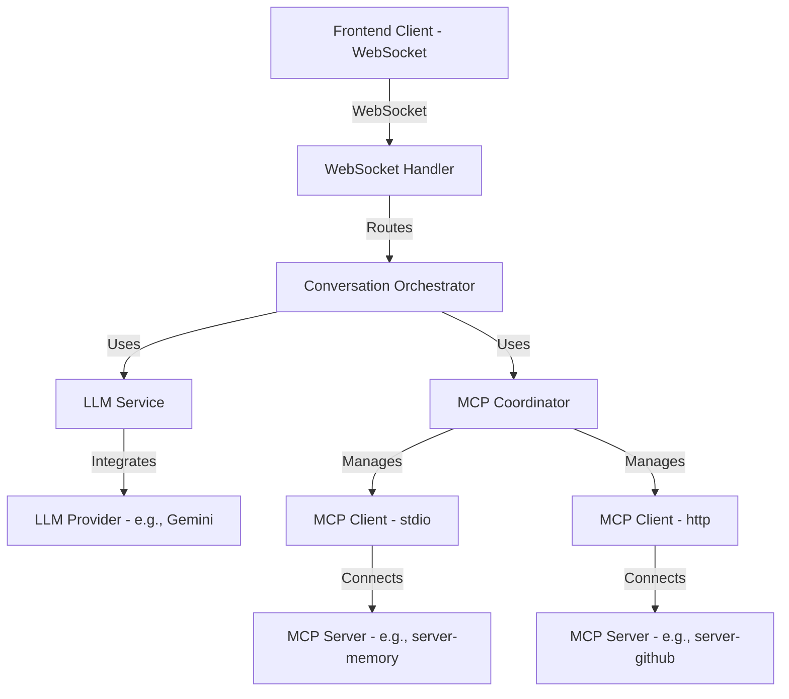

# MCP Host Server: Conceptual Architecture

## 1. Overview
The MCP Host Server is a backend system designed to deliver a real-time chat interface powered by a Large Language Model (LLM), with seamless integration of external tools via the Model Context Protocol (MCP). It leverages WebSocket for frontend communication and dynamically loads MCP server configurations from an `mcp.json` file. The architecture prioritizes modularity, frontend agnosticism, LLM agnosticism, and real-time performance within a single-instance deployment. This design balances simplicity with flexibility, ensuring it meets immediate needs while remaining extensible for future enhancements.

## 2. Core Requirements
- **Real-Time Chat Interface**: Provide a WebSocket-based API for frontend clients to interact with the LLM in real time, streaming responses as they are generated.
- **MCP Tool Integration**: Dynamically discover and execute tools from MCP servers defined in `mcp.json`, using `stdio` and `http` as the exclusive transport protocols.
- **LLM Agnosticism**: Abstract LLM interactions to support multiple providers (e.g., Gemini, OpenAI, Anthropic), enabling easy swapping without affecting other components.
- **Frontend Agnosticism**: Use a simple, JSON-based WebSocket protocol compatible with any frontend stack, ensuring broad accessibility.
- **Performance**: Optimize for low-latency, I/O-bound operations to deliver a responsive user experience.
- **Single-Instance Operation**: Design for a single server instance with no need for horizontal scaling or distributed state management.

## 3. Architecture Diagram

## 4. Module Separation and Naming

### 4.1 WebSocket Handler
- **Role**: Manages WebSocket connections from frontend clients, routing incoming messages to the appropriate Conversation Orchestrator instance and streaming responses back in real time.
- **Separation**: Acts as the dedicated communication layer, isolating WebSocket-specific logic from business logic. This separation ensures transport concerns are distinct from chat orchestration.
- **Naming Reasoning**: "WebSocket Handler" is precise, reflecting its exclusive use of WebSocket as the frontend transport per the requirement that WebSocket is the only suitable protocol for real-time chat. Alternatives like "Communication Layer" were considered too broad, while "Frontend Gateway" implied unnecessary complexity.
- **Conclusion**: Retain "WebSocket Handler" for its clarity and alignment with the specified transport.

### 4.2 Conversation Orchestrator
- **Role**: Serves as the central controller for chat sessions, managing in-memory chat history, coordinating LLM interactions, handling tool calls, and ensuring a seamless conversation flow through iterative loops (e.g., LLM → tool → result → LLM).
- **Separation**: This module is the heart of the system, distinct from transport (WebSocket Handler), LLM interactions (LLM Service), and tool management (MCP Coordinator). It orchestrates all components to deliver a cohesive dialogue.
- **Naming Reasoning**: Originally "Chat Manager," this was renamed to "Conversation Orchestrator" to better reflect its directive role in managing the entire conversation lifecycle, including text and tool interactions. "Session Controller" was too narrow, and "Dialogue Coordinator" lacked the emphasis on orchestration.
- **Conclusion**: Adopt "Conversation Orchestrator" for its comprehensive and intuitive depiction of the module’s responsibilities.

### 4.3 LLM Service
- **Role**: Abstracts interactions with LLM providers, providing a standardized interface to generate responses and parse tool call intents (e.g., JSON blobs like `{ "tool": "search_files", "arguments": {"query": "notes"} }`).
- **Separation**: Isolates LLM-specific logic, ensuring provider-specific details (e.g., Gemini API calls) don’t leak into other modules. This abstraction supports swapping LLMs without impacting the system.
- **Naming Reasoning**: "LLM Service" follows service-layer naming conventions (e.g., "Auth Service"), clearly indicating it provides LLM functionality to the orchestrator. "LLM Adapter" was too implementation-focused, and "Response Generator" overlooked tool parsing duties.
- **Conclusion**: Retain "LLM Service" for its conventional clarity and appropriateness as a service module.

### 4.4 MCP Coordinator
- **Role**: Loads MCP server configurations from `mcp.json`, manages MCP Clients (one per server, using `stdio` or `http`), builds a tool registry via `tools/list`, and routes tool execution requests to the correct client.
- **Separation**: Focuses solely on MCP tool integration, abstracting tool-related complexity from the Conversation Orchestrator. This separation keeps tool management modular and independent.
- **Naming Reasoning**: Originally "MCP Aggregator," this was renamed to "MCP Coordinator" to reflect its active role in coordinating tool discovery, client management, and execution routing. "Tool Registry" ignored client management, and "MCP Broker" suggested a message-passing focus not present here.
- **Conclusion**: Adopt "MCP Coordinator" for its accurate representation of coordination duties.

### 4.5 MCP Clients
- **Role**: Instances of the MCP SDK’s `Client`, each connecting to a single MCP server via `stdio` or `http` to execute tools and return results.
- **Separation**: These are lightweight, per-server connectors managed by the MCP Coordinator, ensuring transport-specific logic (stdio/http) is encapsulated and modular.
- **Naming Reasoning**: "MCP Clients" aligns with the MCP SDK terminology and clearly indicates their role as client instances to MCP servers. No alternative was deemed necessary.
- **Conclusion**: Retain "MCP Clients" for its simplicity and consistency with the protocol.

## 5. Data Flow
1. **User Input**: Frontend sends a JSON message (e.g., `{ "type": "message", "payload": {"text": "Search my files"} }`) via WebSocket.
2. **Routing**: WebSocket Handler forwards the message to the Conversation Orchestrator associated with the session.
3. **Processing**: Conversation Orchestrator appends the input to the chat history and sends it, along with available tools, to the LLM Service.
4. **LLM Response**: LLM Service generates a response, yielding either text chunks (e.g., "I’ll search…") or a tool call intent (e.g., `{ "tool": "search_files", "arguments": {"query": "files"} }`).
5. **Tool Execution**: For tool calls, Conversation Orchestrator delegates to the MCP Coordinator, which routes the request (e.g., `tools/call`) to the appropriate MCP Client. The client executes the tool and returns the result (e.g., `{"files": ["file1.txt"]}`).
6. **Feedback Loop**: Tool results are appended to the chat history (e.g., `System: Tool result: {"files": ["file1.txt"]}`) and fed back to the LLM Service for further processing.
7. **Streaming**: Conversation Orchestrator streams responses (text or status updates like `{ "type": "status", "state": "processing" }`) to the WebSocket Handler, which sends them to the frontend.

## 6. Key Design Decisions
- **WebSocket as Frontend Transport**: Chosen for its real-time, bidirectional capabilities, ideal for chat applications and explicitly specified as the only necessary frontend protocol.
- **Stdio and HTTP for MCP**: Limited to `stdio` and `http` as the exclusive MCP transports, avoiding unnecessary abstraction since these suffice for current MCP servers (e.g., `server-memory`, `server-github`).
- **In-Memory State**: Chat history is stored in memory per session, aligning with the single-instance, non-persistent requirement.
- **Sequential Tool Execution**: Tools are executed one at a time within a chat turn, simplifying implementation while meeting performance needs for a single user session.
- **JSON-Based Tool Calls**: LLM invokes tools via structured JSON blobs (e.g., `{ "tool": "search_files", "arguments": {...} }`), chosen for compatibility with MCP’s JSON-RPC protocol and ease of parsing.
- **Modular Separation**: Each module has a single responsibility, enhancing maintainability and allowing targeted updates (e.g., swapping LLMs).

## 7. Extended Considerations
### 7.1 Error Handling
- **Role**: Manages failures across components:
  - **LLM Failures**: Retry once or return a fallback response (e.g., “Sorry, I couldn’t process that”).
  - **Tool Failures**: Inform the LLM of errors (e.g., `System: Tool search_files failed: No files found`), enabling recovery prompts.
  - **WebSocket Issues**: Gracefully handle disconnections with reconnection prompts to the frontend.
- **Integration**: Embedded in the Conversation Orchestrator to centralize error logic, with potential for a standalone Error Manager in future iterations.

### 7.2 Configuration Management
- **Role**: Loads and validates `mcp.json` (e.g., `{ "servers": {"memory": {"type": "local", "command": "npx server-memory"}} }`), with potential for runtime updates.
- **Separation**: Could be a standalone module to offload configuration parsing from the MCP Coordinator, though initially integrated there for simplicity.

### 7.3 Chat History Format
- **Structure**: Stored as an array of messages with the following schema:
  ```typescript
  interface ChatMessage {
    role: "user" | "assistant" | "system";
    content: string | object;
    tool_name?: string;
    timestamp?: number;
  }
  ```
- **Example**:
  ```json
  [
    {
      "role": "user",
      "content": "Search my files for notes",
      "timestamp": 1710000000000
    },
    {
      "role": "assistant",
      "content": {
        "tool": "search_files",
        "arguments": {
          "query": "notes"
        }
      },
      "timestamp": 1710000000001
    },
    {
      "role": "system",
      "content": {
        "files": ["notes.txt"]
      },
      "tool_name": "search_files",
      "timestamp": 1710000000002
    },
    {
      "role": "assistant",
      "content": "Found notes.txt",
      "timestamp": 1710000000003
    }
  ]
  ```


### 7.4 Frontend Communication Protocol
- **Messages**:
- **Client-to-Server**: `{ "type": "message", "payload": {"text": "User input"} }`
- **Server-to-Client**:
  - Text: `{ "type": "text", "payload": {"content": "LLM response chunk"} }`
  - Status: `{ "type": "status", "state": "processing" | "complete", "tool"?: string, "message": "Running tool", "data"?: object }`
  - End: `{ "type": "end" }`

### 7.5 Future Enhancements
- **Persistence**: Add optional session storage (e.g., file-based or Redis) for multi-device support.
- **Parallel Tools**: Extend MCP Coordinator to execute tools concurrently for complex queries.
- **New Transports**: Support additional MCP transports (e.g., WebSocket) if the protocol evolves.

## 8. Rationale and Evolution
This architecture evolved through extensive discussion:
- **Initial Proposal**: Included broader abstractions (e.g., Communication Interface, Tool Connectors) for maximum agnosticism.
- **Refinement**: Simplified to WebSocket, `stdio`/`http`, and single-instance focus per feedback, retaining modularity.
- **Naming**: Adjusted "Chat Manager" to "Conversation Orchestrator" and "MCP Aggregator" to "MCP Coordinator" for clarity, keeping "LLM Service" and "WebSocket Handler" as fitting descriptors.
- **Completeness**: Extended with error handling, configuration, and history details to ensure a comprehensive design.

This architecture balances your practical constraints with conceptual robustness, ready for both MVP validation and full implementation.