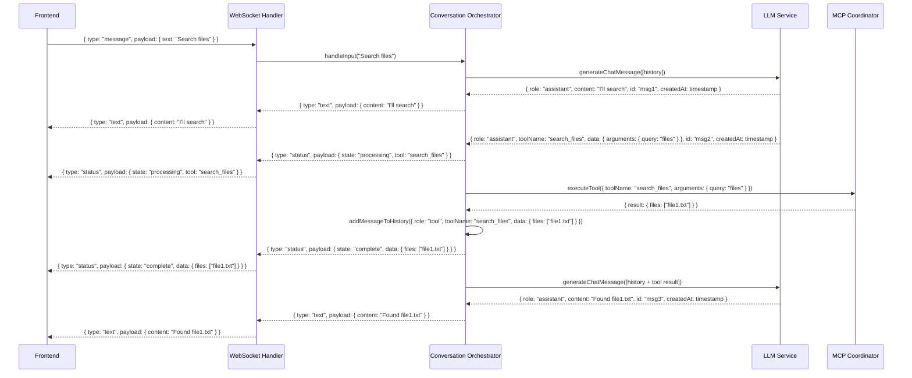
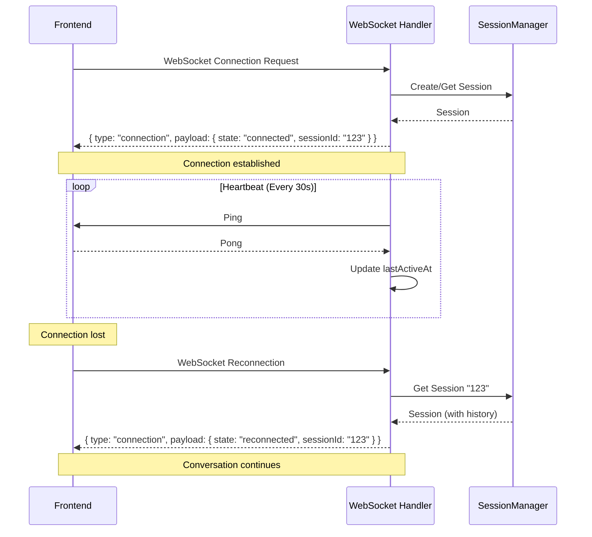

# MCP Host Server: MVP Implementation Specification

## 1. Introduction and Overview

This document provides an architectural specification for the implementation of a Minimum Viable Product (MVP) for the MCP Host Server. Rather than focusing on specific code details, this specification outlines what each component should do, the interfaces between them, and how data flows through the system.

The MCP Host Server enables real-time chat with an LLM (initially Gemini), with seamless integration of tools via the Model Context Protocol (MCP). It uses Node.js with TypeScript, Fastify for WebSocket handling, and the MCP SDK to create a robust, extensible foundation.

## 2. Core System Components

### 2.1 WebSocket Handler

#### Responsibility

Manages bidirectional, real-time communication with frontend clients, including session establishment, message relay, response streaming, and connection health monitoring.

#### Types

```typescript
// Inbound message from frontend client
interface ClientMessage {
  type: 'message';
  payload: {
    text: string;
  };
}

// Connection metadata for tracking client state
interface ConnectionMetadata {
  sessionId: string;
  clientId: string; // Unique per connection
  connectedAt: number;
  lastActiveAt: number;
  userAgent?: string; // For debugging client issues
}

// Outbound messages to frontend client
type ServerMessage =
  | {
      type: 'text';
      payload: {
        content: string;
      };
    }
  | {
      type: 'status';
      payload: {
        state: 'processing' | 'complete';
        tool?: string;
        message: string;
        data?: object;
      };
    }
  | {
      type: 'connection';
      payload: {
        state: 'connected' | 'reconnecting' | 'error';
        message: string;
        sessionId: string;
      };
    };
```

#### Methods

- `setupWebSocket(app: FastifyInstance): void` - Registers WebSocket routes and handlers
- `handleConnection(connection: WebSocket, request: FastifyRequest): void` - Sets up event handlers for a new WebSocket connection
- `sendMessage(connection: WebSocket, message: ServerMessage): void` - Sends a message to a client
- `handleHeartbeat(connection: WebSocket): void` - Process ping/pong for connection health
- `cleanupStaleConnections(): void` - Remove inactive connections
- `getActiveConnections(sessionId?: string): ConnectionMetadata[]` - Get active connections

#### Flow

1. Client establishes WebSocket connection to `/ws` endpoint
2. Handler creates or retrieves a session for this connection
3. Handler sends "connected" message with sessionId
4. Handler sets up heartbeat monitoring
5. Handler listens for messages from client
6. When messages arrive, they're forwarded to the Conversation Orchestrator
7. Responses from the Orchestrator are streamed back to the client
8. Periodically check for and clean up stale connections

### 2.2 Conversation Orchestrator

#### Responsibility

Acts as the central coordinator for the entire chat experience, managing conversation state, delegating to the LLM and tools, and ensuring coherent conversation flow.

#### Types

```typescript
// Core message type for the conversation history
interface ChatMessage {
  id: string; // Unique identifier
  role: 'user' | 'assistant' | 'system' | 'tool';
  content?: string; // Text content (for user/assistant/system)
  data?: any; // Structured data (for tool results)
  createdAt: number; // Timestamp
  toolName?: string; // Name of tool if role is "tool"
  kind?: 'start' | 'progress' | 'complete'; // Message phase for tools
  metadata?: Record<string, any>; // Additional message metadata
}

// Configuration for the orchestrator
interface OrchestratorConfig {
  maxHistoryLength: number;
  retryAttempts: number;
  retryDelay: number;
  maxTokenCount?: number; // For context window management
}

// For managing LLM context window size
interface HistoryManagementOptions {
  maxTokenCount: number; // Max tokens to send to LLM
  summarizationThreshold: number; // When to summarize old messages
  retainNewestMessages: number; // Always keep N newest messages
}

// Enhanced error tracking
interface ErrorContext {
  component: string;
  action: string;
  attemptCount: number;
  originalError: Error;
  recoveryAction?: 'retry' | 'fallback' | 'abort';
  timestamp: number;
  sessionId: string;
  requestId: string;
}
```

#### Methods

- `constructor(llmService: LLMService, mcpCoordinator: MCPCoordinator, config: OrchestratorConfig)`
- `async *handleInput(sessionId: string, text: string): AsyncGenerator<ServerMessage>` - Processes user input, yields responses
- `addMessageToHistory(sessionId: string, message: ChatMessage): void` - Adds a message to the conversation history
- `getHistory(sessionId: string): ChatMessage[]` - Retrieves the conversation history
- `async *processToolCall(sessionId: string, toolCall: ToolCallRequest): AsyncGenerator<ServerMessage>` - Processes a tool call
- `pruneHistory(sessionId: string, options?: HistoryManagementOptions): ChatMessage[]` - Manage context window
- `createSystemMessage(content: string, metadata?: object): ChatMessage` - Helper for consistent system messages
- `abortActiveToolExecution(sessionId: string, requestId: string): Promise<boolean>` - Cancel running tool calls
- `handleErrorWithContext(context: ErrorContext): Promise<void>` - Process errors with structured context

#### Flow

1. Receives user input from WebSocket Handler
2. Adds user message to history
3. Prunes history if needed to manage context window
4. Sends history to LLM Service for response generation
5. For text responses: streams to client via WebSocket Handler
6. For tool calls:
   - Parses the tool call JSON
   - Sends "processing" status to client
   - Delegates to MCP Coordinator for execution
   - Adds tool result to history
   - Sends "complete" status with result
   - Re-prompts LLM with the result for follow-up response

#### Error Handling

- Retries LLM calls up to configured limit with delay between attempts
- Logs all errors with structured context (session ID, timestamp, component)
- For unrecoverable errors, sends a user-friendly fallback message
- Detects and mitigates LLM hallucinations (e.g., calling non-existent tools)
- Handles aborted requests cleanly (e.g., client disconnects mid-request)

### 2.3 LLM Service

#### Responsibility

Abstracts interactions with LLM providers, handling prompting, streaming, and parsing of tool call intents. Handles conversion from raw LLM responses to structured chat messages for the conversation history. It assembles the final system prompt by combining a base prompt, host-defined instructions (like tool call format), tool definitions, and server-provided guidance retrieved via the MCP Coordinator.

#### Types

```typescript
// Interface for LLM providers (Gemini, OpenAI, etc.)
interface LLMService {
  initialize(config: LLMConfig): Promise<void>;

  // Primary method that returns properly formatted ChatMessage objects
  async *generateChatMessage(
    history: ChatMessage[],
    toolDefinitions: ToolDefinition[],
    serverToolPrompts: Map<string, string>,
    options?: GenerationOptions
  ): AsyncGenerator<ChatMessage>;

  // Internal method for raw LLM responses (implementation detail)
  protected async *generateRawResponse(
    history: ChatMessage[],
    options?: GenerationOptions
  ): AsyncGenerator<LLMRawResponse>;
}

// Raw response from an LLM, either text or a tool call
type LLMRawResponse =
  | { type: "text"; content: string; }
  | {
      type: "tool_call";
      tool: string;
      arguments: object;
    };

// Configuration for LLM
interface LLMConfig {
  apiKey: string;
  model: string;
  temperature: number;
  systemPrompt: string;
  maxRetries: number;
  timeoutMs: number;
}

// For token management
interface TokenUsage {
  promptTokens: number;
  completionTokens: number;
  totalTokens: number;
}

// For streaming control
interface GenerationOptions {
  maxTokens?: number;
  timeoutMs?: number;
  abortSignal?: AbortSignal;
  requestId?: string;
}

// Error type for LLM failures
class LLMServiceError extends Error {
  constructor(
    message: string,
    public readonly cause: Error,
    public readonly context: {
      model: string;
      promptTokens?: number;
      attemptCount: number;
    }
  ) {
    super(message);
  }
}
```

#### Methods

- `constructor(config: LLMConfig)`
- `async *generateChatMessage(history: ChatMessage[], toolDefinitions: ToolDefinition[], serverToolPrompts: Map<string, string>, options?: GenerationOptions): AsyncGenerator<ChatMessage>` - Generates formatted chat messages from the LLM, incorporating tool definitions and server-provided prompts (or generated fallbacks).
- `protected async *generateRawResponse(history: ChatMessage[], options?: GenerationOptions): AsyncGenerator<LLMRawResponse>` - Internal method for generating raw responses
- `formatHistoryForLLM(history: ChatMessage[]): FormattedHistory` - Prepares history for LLM consumption
- `parseToolCall(text: string): ToolCallRequest | null` - Attempts to parse a tool call JSON blob
- `convertRawResponseToChatMessage(response: LLMRawResponse): ChatMessage` - Maps raw LLM responses to ChatMessage format
- `estimateTokenCount(text: string): number` - Approximate token count for context management
- `compileSystemPrompt(basePrompt: string, toolDefinitions: ToolDefinition[], serverToolPrompts: Map<string, string>): string` - Assembles the final system prompt including base instructions, tool list, JSON output format rules, and server-specific guidance (fetched or fallback).
- `abortGeneration(requestId: string): boolean` - Cancel an in-progress generation
- `getTokenUsage(sessionId: string): TokenUsage | null` - Get token usage for billing/monitoring

#### Flow

1. Receives conversation history, available tool definitions, and fetched server tool description prompts from Orchestrator.
2. Formats history according to the LLM's expected input format.
3. Assembles the final system prompt using `compileSystemPrompt`:
   - Includes base system instructions.
   - **Crucially, includes host-defined rules for tool invocation format (e.g., "Respond ONLY with JSON wrapped in `tool ... ` delimiters").**
   - Lists available tools with descriptions and parameters.
   - Appends the specific textual guidance fetched from each server's `"tool-descriptions"` prompt or the generated fallback.
4. Estimates token count to verify within limits.
5. Internally streams raw LLM responses via `generateRawResponse`.
   - **Handles potential chunking:** Implements buffering logic to assemble complete tool call JSON blobs even if they arrive across multiple stream chunks, using the specified delimiters (e.g., `tool ... `) to identify the start and end of the JSON block.
6. Converts each raw response to a structured ChatMessage via `convertRawResponseToChatMessage`:
   - Text responses (outside delimiters) become assistant messages with text content.
   - **Successfully parsed JSON tool calls (assembled from buffer) become assistant messages with tool metadata.**
   - Handles potential malformed JSON (parsing errors after assembling the complete block) gracefully (e.g., logs error, returns a system error message).
   - Handles streaming errors (e.g., incomplete delimiter blocks) gracefully.
7. Yields properly formatted ChatMessage objects to the Orchestrator.
8. Handles timeouts or client cancellations.

#### Prompt Engineering for Tools

- Relies on the `compileSystemPrompt` method to assemble the context.
- **Crucially includes a host-defined instruction mandating the exact output format for tool calls, including wrapping the JSON in specific delimiters (e.g., `tool ... `).** Example: "When you need to use a tool, respond ONLY with the tool call JSON object enclosed in triple backticks like this:\n\`\`\`tool\n{ \"tool\": \"qualifiedToolName\", \"arguments\": { /_ args _/ } }\n\`\`\`\nDo not add any other text before the opening \`\`\`tool or after the closing \`\`\`."
- Leverages the specific instructions fetched from each server's `"tool-descriptions"` prompt (or generated fallback).
- Instructs the LLM (via the base prompt) to maintain a coherent narrative around tool calls and handle results naturally.

### 2.4 MCP Coordinator

#### Responsibility

Manages connections to MCP servers, discovers tools, retrieves server-specific tool usage guidance prompts (or generates fallbacks), and handles tool execution requests. Maintains a unified registry of tools with their metadata, validation schemas, and reliability metrics.

#### Types

```typescript
// Configuration for an MCP server from mcp.json
interface ServerConfig {
  id: string;
  type: 'local' | 'remote';
  transport: 'stdio' | 'http';
  command?: string; // For stdio transport
  args?: string[]; // For stdio transport
  url?: string; // For http transport
  timeoutMs?: number; // Tool execution timeout
}

// Tool call request
interface ToolCallRequest {
  toolName: string; // Can be qualified (server:tool) or unqualified
  arguments: object;
  requestId: string;
  timeoutMs?: number; // Per-call timeout
}

// Tool call response
interface ToolCallResponse {
  toolName: string;
  result: any;
  error?: {
    code: number;
    message: string;
  };
  requestId: string;
  executionTimeMs: number; // How long the call took
}

// Tool definition from the MCP server
interface ToolDefinition {
  name: string;
  description: string;
  parameters: object; // JSON Schema for validation
  examples?: object[]; // Example valid arguments
}

// Stored content from server "tool-descriptions" prompts
interface ServerToolDescriptionPrompts extends Map<string, string> {} // Map<serverId, promptText>

// Comprehensive tool registry entry
interface ToolRegistryEntry {
  // Core definition
  qualifiedName: string; // Format: "{serverId}:{toolName}"
  definition: ToolDefinition;

  // Server info
  serverId: string;
  client: object; // The MCP Client instance
  transportType: 'stdio' | 'http';

  // Reliability metrics
  reliability: {
    successCount: number;
    failureCount: number;
    lastFailure?: number;
    circuitOpen: boolean;
  };

  // Performance metrics
  performance: {
    avgResponseTimeMs: number;
    callCount: number;
    lastUsed: number;
  };
}

// Request options
interface ToolExecutionOptions {
  timeoutMs?: number;
  priority?: 'high' | 'normal' | 'low';
  retryOptions?: {
    maxRetries: number;
    delayMs: number;
    retryableErrorCodes: number[];
  };
}

// Specific error types for better error handling
class ToolNotFoundError extends Error {
  constructor(toolName: string) {
    super(`Tool not found: ${toolName}`);
    this.name = 'ToolNotFoundError';
  }
}

class ToolValidationError extends Error {
  constructor(
    public readonly toolName: string,
    public readonly validationErrors: any[],
  ) {
    super(`Invalid arguments for tool: ${toolName}`);
    this.name = 'ToolValidationError';
  }
}

class CircuitOpenError extends Error {
  constructor(
    public readonly toolName: string,
    public readonly failureCount: number,
    public readonly lastFailure: number,
  ) {
    super(`Circuit open for tool: ${toolName} after ${failureCount} failures`);
    this.name = 'CircuitOpenError';
  }
}

// Error type for tool failures
class ToolExecutionError extends Error {
  constructor(
    message: string,
    public readonly cause: Error,
    public readonly context: {
      toolName: string;
      serverId: string;
      requestId: string;
      arguments: object;
    },
  ) {
    super(message);
    this.name = 'ToolExecutionError';
  }
}
```

#### Methods

- `constructor(configPath: string)`
- `async initialize(): Promise<void>` - Loads configuration, connects to servers, discovers tools, fetches "tool-descriptions" prompts (or generates fallback descriptions), and builds tool registry.
- `getAvailableTools(): ToolDefinition[]` - Returns the list of all available tools.
- `getToolRegistryEntry(toolName: string): ToolRegistryEntry | null` - Gets full tool info including reliability.
- `getToolDescriptionPrompt(serverId: string): string | null` - Retrieves the pre-fetched/generated guidance text for a specific server.
- `resolveToolName(toolName: string): string` - Resolves unqualified to qualified tool names (handles potential conflicts).
- `async validateToolArguments(toolName: string, args: object): Promise<boolean | { errors: any[] }>` - Validates args against JSON Schema.
- `async executeTool(request: ToolCallRequest, options?: ToolExecutionOptions): Promise<ToolCallResponse>` - Executes a tool with integrated validation and circuit breaking.
- `async shutdown(): Promise<void>` - Gracefully shuts down all MCP clients.
- `abortToolExecution(requestId: string): Promise<boolean>` - Cancel running tool call
  // `async reloadToolRegistry(): Promise<void>` - Refresh tool registry without restart (Deferred post-MVP)
- `recordToolSuccess(toolName: string, executionTimeMs: number): void` - Record successful execution.
- `recordToolFailure(toolName: string, error: Error): void` - Record failure and update circuit status.
- `isCircuitOpen(toolName: string): boolean` - Check if circuit breaker is open for tool.

#### Flow

1. On initialization:

   - Loads and validates mcp.json using Zod schema.
   - Creates MCP clients for each server using appropriate transport and connects them.
   - Initializes `toolDescriptionPrompts = new Map<string, string>()`.
   - For each successfully connected client (`serverId`):
     - Calls `tools/list` to discover available tools, storing the `ToolDefinition`s temporarily.
     - Attempts to call `prompts/get` with `name: "tool-descriptions"`.
     - **If successful and response is valid** (single message, user role, text type): Extracts `content.text` and stores it in `toolDescriptionPrompts[serverId]`.
     - **If fetch fails or response is invalid:**
       - Logs a warning (e.g., "'tool-descriptions' prompt missing/invalid for server [serverId]. Generating fallback description.").
       - Retrieves the stored `ToolDefinition`s for this `serverId`.
       - Calls `generateFallbackToolDescription(serverId, definitions)` to create a fallback string.
       - Stores the generated fallback string in `toolDescriptionPrompts[serverId]`.
   - Builds the comprehensive tool registry using qualified names (e.g., "filesystem:search_files"), storing tool definitions and associating them with clients.
   - Sets up initial reliability metrics for all tools.
   - Handles and logs potential tool name conflicts between servers.

2. When discovering tools (as part of initialization):

   - Creates qualified names (e.g., "filesystem:search_files").
   - Stores full tool definitions with JSON Schema.
   - Handles tools with same name from different servers via qualified names and logs warnings about potential ambiguity if unqualified names are used later.

3. When executing a tool:

   - Resolves tool name (adds server prefix if unqualified, potentially erroring on ambiguity).
   - Checks circuit breaker status before execution.
   - Validates arguments against tool's JSON Schema.
   - Looks up the appropriate client in the registry.
   - Sets up timeout handling based on tool and request settings.
   - Executes the tool via the client.
   - Records success/failure to update reliability metrics.
   - Returns structured response with result or error.

4. For reliability tracking:
   - Integrates circuit breaker directly in execution flow.
   - Decrements failure count on success (recovers gradually).
   - Opens circuit after threshold failures within time window (thresholds configurable).
   - Provides clear errors when circuit is open.
   - Auto-resets circuit after cool-down period (configurable).

#### Error Handling

- Validates mcp.json schema on startup
- Validates tool arguments before execution
- Implements structured retry logic for transient tool failures
- Tracks and surfaces detailed error information
- Gracefully handles server disconnections
- Implements tool-specific timeouts
- Uses circuit breaker to protect against repeatedly failing tools

### 2.5 Cross-Cutting Concerns

#### Session Management

```typescript
interface SessionManager {
  createSession(metadata?: object): string;
  getSession(sessionId: string): Session | null;
  addConnectionToSession(sessionId: string, connectionId: string): void;
  removeConnectionFromSession(sessionId: string, connectionId: string): void;
  getAllSessions(): Session[];
  cleanupInactiveSessions(maxAgeMs: number): void;
}

interface Session {
  id: string;
  createdAt: number;
  lastActiveAt: number;
  connectionId: string; // Single connection ID per session
  history: ChatMessage[];
  metadata: object;
}
```

#### Request Correlation and Tracing

```typescript
interface RequestContext {
  requestId: string;
  sessionId: string;
  parentRequestId?: string;
  startTime: number;
  traceId: string;
  labels: Record<string, string>;
}
```

#### Standard System Messages

```typescript
const SYSTEM_MESSAGES = {
  WELCOME:
    "Hello! I'm an AI assistant that can help answer questions and use tools to get information.",
  TOOL_ERROR: (toolName: string, error: string) =>
    `I encountered an error when using the ${toolName} tool: ${error}. Let me try a different approach.`,
  RATE_LIMITED: "I'm currently processing too many requests. Please try again in a moment.",
  MAINTENANCE: 'The system is currently undergoing maintenance. Some features may be unavailable.',
};
```

## 3. Project Structure

A well-organized project structure is crucial for maintainability, scalability, and developer collaboration. This structure reflects the modular architecture defined above.

```
.
├── .env              # Environment variables (API keys, configs)
├── .env.example      # Example environment file
├── .eslintrc.js      # ESLint configuration
├── .gitignore        # Git ignore rules
├── .prettierrc.js    # Prettier configuration
├── jest.config.js    # Jest test runner configuration
├── mcp.json          # Default MCP server configurations
├── mcp.schema.json   # JSON schema for validating mcp.json
├── package.json      # Project dependencies and scripts
├── README.md         # Project overview and setup instructions
├── tsconfig.json     # TypeScript compiler options
│
├── src/              # Source code directory
│   ├── core/         # Core business logic modules
│   │   ├── orchestrator/ # Conversation Orchestrator logic
│   │   │   ├── index.ts
│   │   │   └── ConversationOrchestrator.ts
│   │   ├── llm/        # LLM Service logic
│   │   │   ├── index.ts
│   │   │   ├── LLMService.ts
│   │   │   └── adapters/ # LLM provider-specific implementations
│   │   │       └── GeminiAdapter.ts
│   │   └── mcp/        # MCP Coordinator logic
│   │       ├── index.ts
│   │       ├── MCPCoordinator.ts
│   │       └── utils/  # MCP-specific utilities (e.g., fallback generation)
│   │           └── generateFallbackPrompt.ts
│   │
│   ├── handlers/     # Request handlers (entry points)
│   │   └── websocket/  # WebSocket Handler logic
│   │       ├── index.ts
│   │       └── WebSocketHandler.ts
│   │
│   ├── config/       # Configuration loading and validation
│   │   ├── index.ts
│   │   ├── env.ts      # Environment variable loading/validation (Zod)
│   │   └── mcpConfig.ts # mcp.json loading/validation (Zod)
│   │
│   ├── session/      # Session management logic
│   │   ├── index.ts
│   │   └── SessionManager.ts # In-memory implementation for MVP
│   │
│   ├── types/        # Shared TypeScript interfaces and types
│   │   ├── index.ts
│   │   ├── mcp.ts      # MCP-related types (ToolDefinition, ServerConfig)
│   │   ├── chat.ts     # ChatMessage, ServerMessage, ClientMessage
│   │   └── core.ts     # Session, RequestContext, etc.
│   │
│   ├── utils/        # General utility functions
│   │   ├── index.ts
│   │   ├── logger.ts   # Pino logger setup
│   │   ├── errors.ts   # Custom error classes
│   │   └── constants.ts # Shared constants (e.g., SYSTEM_MESSAGES)
│   │
│   └── server.ts     # Main application entry point (Fastify server setup)
│
└── tests/            # Test files
    ├── fixtures/     # Mock data, sample configs (e.g., mock-mcp.json)
    ├── integration/  # Integration tests (e.g., WebSocket <-> Orchestrator)
    └── unit/         # Unit tests mirroring the src structure
        ├── core/
        │   ├── orchestrator.test.ts
        │   ├── llm.test.ts
        │   └── mcp.test.ts
        ├── handlers/
        │   └── websocket.test.ts
        └── session/
            └── sessionManager.test.ts
```

#### Key Directory Explanations:

- **`src/`**: Contains all application source code.
  - **`core/`**: Houses the main business logic modules (Orchestrator, LLM Service, MCP Coordinator), separated for clarity.
  - **`handlers/`**: Entry points for external interactions. For MVP, this is solely the `websocket` handler.
  - **`config/`**: Centralizes loading and validation of all configurations (`.env`, `mcp.json`).
  - **`session/`**: Dedicated module for managing user sessions.
  - **`types/`**: Global TypeScript definitions, organized by domain (chat, mcp, core).
  - **`utils/`**: Shared utilities like logging, custom errors, and constants.
  - **`server.ts`**: Initializes and starts the Fastify server, bringing all components together.
- **`tests/`**: Contains all test code, structured to mirror `src/` for easy navigation. Includes unit, integration, and potentially end-to-end tests (Phase 7).
- **Root Files**: Standard configuration files (`.env`, `tsconfig.json`, `package.json`, etc.), `mcp.json` for server definitions, and its validation schema.

This structure promotes clear separation of concerns, facilitates testing, and supports future expansion by providing logical locations for new features or modules (e.g., adding REST handlers, persistent storage adapters).

## 4. Implementation Phases

### Phase 1: Project Setup and Core Type Definitions

- Initialize Node.js project with TypeScript
- Configure ESLint, Prettier, Jest
- Set up directory structure **(as defined in Section 3)**
- Add core dependencies:
  - fastify, @fastify/websocket
  - @modelcontextprotocol/sdk
  - @google/generative-ai (for Gemini)
  - zod (for validation)
  - dotenv (for environment variables)
  - pino (for logging)
- Configure structured logger (Pino) for different environments (dev, prod).
- Implement all interface and type definitions from Section 2 **(placing them in `src/types/`)**.
- Create validation schemas using Zod (for config, messages, etc.) **(placing them in `src/config/`)**.
- Implement base error classes (`LLMServiceError`, `ToolExecutionError`, etc.) and `RequestContext` type **(placing them in `src/utils/errors.ts` and `src/types/core.ts`)**.
- Set up the session management interface (`SessionManager`) **(placing it in `src/session/`)**.
- Implement standard system messages constants **(placing them in `src/utils/constants.ts`)**.

### Phase 2: MCP Coordinator Implementation

- Implement configuration loading (`mcp.json`, `.env`) and validation with Zod **(in `src/config/`)**.
- Create client initialization logic for stdio and http transports **(in `src/core/mcp/MCPCoordinator.ts`)**.
- Design and implement unified tool registry with qualified names **(in `src/core/mcp/MCPCoordinator.ts`)**.
- Implement discovery of tools (`tools/list`) and prompts (`prompts/get` for `"tool-descriptions"`) **(in `src/core/mcp/MCPCoordinator.ts`)**.
- Implement the fallback prompt generation logic (`generateFallbackToolDescription`) if `"tool-descriptions"` is missing/invalid **(in `src/core/mcp/utils/generateFallbackPrompt.ts`)**.
- Add JSON Schema validation for tool arguments (`validateToolArguments`) **(in `src/core/mcp/MCPCoordinator.ts`)**.
- Implement integrated circuit breaker for reliability (with configurable parameters) **(in `src/core/mcp/MCPCoordinator.ts`)**.
- Add tool execution (`executeTool`) with proper error handling **(in `src/core/mcp/MCPCoordinator.ts`)**.
- Implement tool performance and reliability metrics collection **(in `src/core/mcp/MCPCoordinator.ts`)**.
- Add timeout and cancellation support for tool execution **(in `src/core/mcp/MCPCoordinator.ts`)**.
- Build structured error handling with specific error types (`ToolNotFoundError`, etc.) **(in `src/utils/errors.ts`)**.
- Create comprehensive unit tests using mocked MCP clients/servers **(in `tests/unit/core/mcp.test.ts`)**.

### Phase 3: LLM Service Implementation

- Create base LLM service interface (`LLMService`) **(in `src/core/llm/LLMService.ts`)**.
- Implement Gemini adapter conforming to the interface **(in `src/core/llm/adapters/GeminiAdapter.ts`)**.
- Add token counting (`estimateTokenCount`) and basic context management helpers **(in `src/core/llm/LLMService.ts`)**.
- Implement `compileSystemPrompt` logic to assemble prompts from base, host rules, tool definitions, and server guidance (fetched/fallback) **(in `src/core/llm/LLMService.ts`)**.
- Add raw response generation implementation (`generateRawResponse`) **(in `src/core/llm/LLMService.ts`)**.
- Implement `convertRawResponseToChatMessage` including handling of text and valid/malformed tool call JSON **(in `src/core/llm/LLMService.ts`)**.
- Implement streaming chat message handling via async generators **(in `src/core/llm/LLMService.ts`)**.
- Add timeout and cancellation support for LLM generation **(in `src/core/llm/LLMService.ts`)**.
- Build structured error handling with `LLMServiceError` **(in `src/utils/errors.ts`)**.
- Add comprehensive unit tests using mocked LLM API responses (text, valid JSON, invalid JSON, errors) **(in `tests/unit/core/llm.test.ts`)**.

### Phase 4: Session Management Implementation

- Implement `SessionManager` interface **(in `src/session/SessionManager.ts`)**.
- Implement session creation and retrieval logic **(in `src/session/SessionManager.ts`)**.
- Build connection tracking per session (mapping `connectionId` to `sessionId`) **(in `src/session/SessionManager.ts`)**.
- Implement session cleanup for stale sessions **(in `src/session/SessionManager.ts`)**.
- Explicitly note: MVP uses an in-memory store for sessions (persistence is post-MVP).
- Add unit tests for session management logic **(in `tests/unit/session/sessionManager.test.ts`)**.

### Phase 5: Conversation Orchestrator Implementation

- Integrate with Session Manager for session state **(in `src/core/orchestrator/ConversationOrchestrator.ts`)**.
- Implement message history tracking and storage within the `Session` object **(in `src/core/orchestrator/ConversationOrchestrator.ts`)**.
- Add context window management (`pruneHistory` - initially simple truncation based on token count) **(in `src/core/orchestrator/ConversationOrchestrator.ts`)**.
- Build the main processing loop (`handleInput`) for user inputs **(in `src/core/orchestrator/ConversationOrchestrator.ts`)**.
- **Fetch necessary data (tool definitions, server prompts/fallbacks) from MCP Coordinator.**
- **Pass required context (history, tool definitions, server prompts) to LLM Service.**
- Use LLM Service's `generateChatMessage` to get structured responses (text or tool calls).
- Implement tool call handling: parse request from `ChatMessage`, delegate to `MCPCoordinator.executeTool`, add result back to history, re-prompt LLM **(in `src/core/orchestrator/ConversationOrchestrator.ts`)**.
- Integrate error recovery flows (LLM retries, tool errors) and structured logging **(in `src/core/orchestrator/ConversationOrchestrator.ts`)**.
- Implement abort/cancellation handling for ongoing requests **(in `src/core/orchestrator/ConversationOrchestrator.ts`)**.
- Add comprehensive unit tests with mocked dependencies (LLM Service, MCP Coordinator, Session Manager) to verify state transitions and flow logic **(in `tests/unit/core/orchestrator.test.ts`)**.

### Phase 6: WebSocket Handler Implementation

- Set up Fastify server with `@fastify/websocket` plugin **(in `src/server.ts`)**.
- Implement connection handler (`handleConnection`) to manage WebSocket lifecycle **(in `src/handlers/websocket/WebSocketHandler.ts`)**.
- Integrate with Session Manager to associate connections with sessions **(in `src/handlers/websocket/WebSocketHandler.ts`)**.
- Add connection health monitoring (heartbeats) **(in `src/handlers/websocket/WebSocketHandler.ts`)**.
- Build message routing logic (incoming messages to Orchestrator, outgoing messages from Orchestrator to client via `sendMessage`) **(in `src/handlers/websocket/WebSocketHandler.ts`)**.
- Implement response streaming for `text` and `status` messages yielded by the Orchestrator **(in `src/handlers/websocket/WebSocketHandler.ts`)**.
- Add connection cleanup for stale connections (`cleanupStaleConnections`) **(in `src/handlers/websocket/WebSocketHandler.ts`)**.
- Build integration tests for the WebSocket interface interacting with a mocked Orchestrator **(in `tests/integration/websocket.test.ts`)**.

### Phase 7: Integration and E2E Testing

- Connect all implemented components **(in `src/server.ts`)**.
- Implement and verify request context propagation (e.g., using `AsyncLocalStorage`).
- Create end-to-end test scenarios covering:
  - Basic chat.
  - Tool invocation (successful and failing).
  - Error handling paths (LLM errors, tool errors, timeouts).
  - Connection resilience (disconnect/reconnect if supported).
- Test with real (or near-real) LLM and MCP servers (consider staging environment).
- Verify circuit breaker behavior.
- Perform basic performance/load testing to identify obvious bottlenecks (e.g., N concurrent connections).

## 5. Logging and Observability

### 5.1 Logging Strategy

- Use structured logging with Pino
- Include consistent fields in all logs:
  - sessionId
  - requestId
  - component (WebSocket, Orchestrator, LLM, MCP)
  - action (e.g., "message_received", "tool_execution_start")
  - timestamp
  - correlationId (to track request flow)
- Log levels:
  - trace: Fine-grained debugging
  - debug: Development information
  - info: Regular operation events
  - warn: Concerning but non-fatal issues
  - error: Failures requiring attention

### 5.2 Key Logging Points

- WebSocket connections and disconnections
- Connection heartbeats and health checks
- Message receipt and sending
- LLM prompting and response parsing
- Token usage and context window management
- Tool call requests and responses
- Tool reliability tracking
- Error conditions and retry attempts
- Configuration loading
- Session creation and cleanup

## 6. Error Handling Strategy

### 6.1 Error Categories

- **Transient Errors**: Temporary failures like network issues, rate limits
  - Strategy: Retry with backoff, log attempts
- **Persistent Errors**: Consistent failures like invalid credentials, bad configuration
  - Strategy: Fail fast, log detailed diagnostics, provide clear user message
- **Degraded Operation**: When some functionality works but other parts fail
  - Strategy: Continue with available functionality, notify user of limitations
- **Timeout Errors**: Operations taking too long
  - Strategy: Cancel operation, inform user, log performance metrics

### 6.2 Error Recovery Flows

(Note: These flows are primarily coordinated by the Conversation Orchestrator.)

- **LLM Failures**:
  - Retry up to 3 times with 1-second delay (configurable).
  - If all retries fail, send a standard fallback message to the user (e.g., using `SYSTEM_MESSAGES.LLM_ERROR` or a general error message).
  - Log the failure with prompt and error details.
  - Propagate structured `LLMServiceError` for analysis.
- **Tool Execution Failures**:
  - Retry once for transient errors (or based on `ToolExecutionOptions`).
  - Add error information to conversation history (as a `system` or `tool` message with error state).
  - Re-prompt LLM to handle the failure gracefully (LLM Service prompt should guide this).
  - Use standard feedback (e.g., `SYSTEM_MESSAGES.TOOL_ERROR`) if the LLM cannot recover.
  - Track tool reliability via MCP Coordinator to identify problematic tools (circuit breaker).
  - Propagate structured `ToolExecutionError` for analysis.
- **WebSocket Failures**:
  - Attempt to maintain session state for potential client reconnection (depends on client implementation).
  - Provide reconnection instructions/status via `connection` messages.
  - Use heartbeats to detect zombie connections and trigger cleanup.
  - Clean up server-side resources if reconnection times out.
- **Context Window Overflow**:
  - Detect before sending to LLM via `estimateTokenCount`.
  - Prune history according to strategy (e.g., simple truncation for MVP).
  - Log token counts for monitoring and potential strategy adjustments.

## 7. Security Considerations

### 7.1 Input Validation

- Validate all incoming WebSocket messages against Zod schemas.
- **Input Sanitization (MVP Scope):** Focus on preventing malformed data structures and ensuring type safety. For MVP, complex prompt injection mitigation is out of scope, but basic checks (e.g., unreasonable input length) can be considered.
- Verify tool call arguments match expected JSON Schemas via MCP Coordinator.
- Implement timeouts on all external operations (LLM calls, tool executions).

### 7.2 API Keys and Secrets

- Store all sensitive values (API keys, etc.) in environment variables (`.env` file, loaded via `dotenv`).
- Never expose API keys or secrets to the frontend or in client-facing messages.
- Log sanitized requests (mask or omit credentials/sensitive headers/payload fields).
- Document the process for key rotation.

### 7.3 Tool Permission Scope

- Implement basic allowlisting/denylisting for tools if necessary (can be configured).
- Rely heavily on tool argument validation (JSON Schema) via MCP Coordinator to prevent malformed requests.
- Consider request rate limiting per user/session for expensive or sensitive tools (potentially post-MVP).
- Monitor tool usage patterns for anomalies (requires logging/metrics).

### 7.4 Dependency Management

- Regularly scan dependencies for known vulnerabilities (e.g., using `npm audit` or equivalent tools like Snyk).
- Keep dependencies updated.

### 7.5 Rate Limiting

- Consider implementing basic rate limiting on the WebSocket endpoint (e.g., max messages per second per connection) to prevent simple denial-of-service attacks (potentially post-MVP).

## 8. Deployment and DevOps

### 8.1 Development Environment

- Docker Compose setup with example MCP servers
- Environment variable templates
- Watch mode for rapid development
- Logging configuration for development

### 8.2 Testing Strategy

- Unit tests for each component
- Integration tests for component pairs
- End-to-end tests for full system
- Mock servers for MCP and LLM testing
- Stress tests for connection handling
- Chaos testing for error recovery

### 8.3 Release Process

- Version control with Git
- Semantic versioning
- Automated CI/CD with GitHub Actions
- Containerized deployment
- Automated testing before deployment

## 9. Future Considerations

### 9.1 Performance Optimization

- Implement caching for repeated tool calls
- Add context pruning for long conversations
- Consider parallel tool execution for independent tools
- Pool LLM connections for efficiency

### 9.2 Scaling Beyond MVP

- Add persistent storage for conversation history
- Implement session management across server restarts
- Consider distributed architecture for horizontal scaling
- Implement proper connection draining for graceful restarts

### 9.3 Feature Expansion

- Support additional LLM providers
- Add authentication and multi-user support
- Implement more advanced error recovery strategies
- Add tool execution analytics

## 10. Technical Constraints and Standards

### 10.1 Node.js Version

- Require Node.js 18+ for native fetch support
- Use ESM modules for imports
- Leverage async context features

### 10.2 TypeScript Standards

- Strict type checking enabled
- Explicit return types on public methods
- Properly typed async generators
- No implicit any types

### 10.3 Code Style

- Follow AirBnB style guide
- Use prettier for formatting
- Document all public interfaces with JSDoc
- Max line length of 100 characters

## 11. Appendix

### 11.1 Example Sequence Diagrams

#### User Message Processing



#### Connection Management



### 11.2 Example Config Files

#### mcp.json

```json
{
  "servers": {
    "filesystem": {
      "id": "filesystem",
      "type": "local",
      "transport": "stdio",
      "command": "npx",
      "args": ["@modelcontextprotocol/server-filesystem"],
      "timeoutMs": 10000
    },
    "github": {
      "id": "github",
      "type": "remote",
      "transport": "http",
      "url": "http://github-mcp.example.com",
      "timeoutMs": 15000
    }
  }
}
```

#### .env

```
GEMINI_API_KEY=your_api_key_here
MCP_JSON_PATH=./mcp.json
LOG_LEVEL=info
PORT=3000
MAX_TOKEN_COUNT=8192
DEFAULT_TOOL_TIMEOUT_MS=5000
```

### 11.3 Unified Tool Registry and Circuit Breaker

**Note:** The following TypeScript snippet is a conceptual illustration of how the `MCPCoordinator` might be implemented. It highlights key mechanisms like tool discovery, registry management, execution with circuit breaking, and reliability tracking. It is not a complete or definitive implementation.

```typescript
// Implementation concept
class MCPCoordinator {
  private toolRegistry = new Map<string, ToolRegistryEntry>();
  // Stores fetched/generated prompts: Map<serverId, promptText>
  private serverToolDescriptionPrompts = new Map<string, string>();
  private clients = new Map<string, Client>(); // Assuming MCP SDK Client type
  private activeExecutions = new Map<
    string,
    {
      abortController: AbortController;
      timeout: NodeJS.Timeout;
    }
  >();

  private readonly circuitThreshold = 5;
  private readonly circuitResetTimeMs = 60000; // 1 minute

  async initialize(): Promise<void> {
    // Load configuration
    const config = await this.loadConfig();

    // Initialize clients
    for (const serverConfig of config.servers) {
      const client = new Client({
        transport: serverConfig.transport,
        path: serverConfig.transport === 'stdio' ? serverConfig.command : serverConfig.url,
      });

      await client.connect();
      this.clients.set(serverConfig.id, client);
    }

    // Discover tools and fetch/generate descriptions
    await this.discoverToolsAndDescriptions();
  }

  // Renamed and updated to include prompt handling
  private async discoverToolsAndDescriptions(): Promise<void> {
    for (const [serverId, client] of this.clients.entries()) {
      let toolDefinitions: ToolDefinition[] = []; // Store definitions for fallback generation
      try {
        // 1. Discover tools
        toolDefinitions = await client.listTools(); // Assuming client.listTools() returns ToolDefinition[]

        // 2. Attempt to fetch "tool-descriptions" prompt
        try {
          const promptResponse = await client.getPrompt('tool-descriptions'); // Assuming client.getPrompt(name) method
          // Basic validation (adapt based on actual SDK response structure)
          if (
            promptResponse &&
            promptResponse.messages &&
            promptResponse.messages.length === 1 &&
            promptResponse.messages[0].role === 'user' &&
            promptResponse.messages[0].content.type === 'text'
          ) {
            this.serverToolDescriptionPrompts.set(
              serverId,
              promptResponse.messages[0].content.text,
            );
            console.info(`Successfully fetched 'tool-descriptions' prompt for server ${serverId}.`);
          } else {
            throw new Error('Invalid prompt structure received.'); // Trigger fallback
          }
        } catch (promptError) {
          // 3. Handle fetch failure: Generate fallback description
          console.warn(
            `'tool-descriptions' prompt missing or invalid for server ${serverId}. Generating fallback. Error: ${promptError.message}`,
          );
          const fallbackPrompt = this.generateFallbackToolDescription(serverId, toolDefinitions);
          this.serverToolDescriptionPrompts.set(serverId, fallbackPrompt);
        }

        // 4. Register tools in the registry
        for (const tool of toolDefinitions) {
          const qualifiedName = `${serverId}:${tool.name}`;
          this.toolRegistry.set(qualifiedName, {
            qualifiedName,
            definition: tool,
            serverId,
            client,
            transportType: client.transport,
            reliability: {
              successCount: 0,
              failureCount: 0,
              circuitOpen: false,
            },
            performance: {
              avgResponseTimeMs: 0,
              callCount: 0,
              lastUsed: Date.now(),
            },
          });
        }
      } catch (error) {
        // Log error but continue with other servers
        console.error(`Failed to discover tools for server ${serverId}:`, error);
      }
    }
  }

  // Added helper method for fallback generation (implementation is conceptual)
  private generateFallbackToolDescription(serverId: string, definitions: ToolDefinition[]): string {
    // Simple fallback: List tool names and descriptions
    // A more sophisticated version could summarize parameters etc.
    let description = `Guidance for Server ${serverId}:\nAvailable tools:\n`;
    definitions.forEach((tool) => {
      description += `- ${tool.name}: ${tool.description}\n`;
    });
    if (definitions.length === 0) {
      description += '(No tools discovered)';
    }
    return description;
  }

  // Add method to retrieve the fetched/generated prompt
  getToolDescriptionPrompt(serverId: string): string | null {
    return this.serverToolDescriptionPrompts.get(serverId) || null;
  }

  resolveToolName(toolName: string): string {
    // If already qualified, return as is
    if (toolName.includes(':')) {
      return toolName;
    }

    // Find a tool with this unqualified name
    for (const [qualifiedName, entry] of this.toolRegistry.entries()) {
      if (qualifiedName.endsWith(`:${toolName}`)) {
        return qualifiedName;
      }
    }

    // If not found, return original (will fail later)
    return toolName;
  }

  async executeTool(request: ToolCallRequest): Promise<ToolCallResponse> {
    const qualifiedName = this.resolveToolName(request.toolName);
    const entry = this.toolRegistry.get(qualifiedName);

    if (!entry) {
      throw new ToolNotFoundError(qualifiedName);
    }

    // Check circuit breaker
    if (entry.reliability.circuitOpen) {
      throw new CircuitOpenError(
        qualifiedName,
        entry.reliability.failureCount,
        entry.reliability.lastFailure,
      );
    }

    // Validate arguments
    const validationResult = await this.validateToolArguments(qualifiedName, request.arguments);
    if (validationResult !== true) {
      throw new ToolValidationError(qualifiedName, validationResult.errors);
    }

    // Setup execution with timeout
    const abortController = new AbortController();
    const timeoutMs = request.timeoutMs || 10000; // Default 10s

    const timeout = setTimeout(() => {
      abortController.abort();
    }, timeoutMs);

    this.activeExecutions.set(request.requestId, { abortController, timeout });

    try {
      const startTime = Date.now();
      const result = await entry.client.callTool(entry.definition.name, request.arguments, {
        signal: abortController.signal,
      });

      const executionTimeMs = Date.now() - startTime;

      // Record success
      this.recordToolSuccess(qualifiedName, executionTimeMs);

      return {
        toolName: qualifiedName,
        result,
        requestId: request.requestId,
        executionTimeMs,
      };
    } catch (error) {
      // Record failure
      this.recordToolFailure(qualifiedName, error);

      throw new ToolExecutionError(`Failed to execute tool: ${qualifiedName}`, error, {
        toolName: qualifiedName,
        serverId: entry.serverId,
        requestId: request.requestId,
        arguments: request.arguments,
      });
    } finally {
      clearTimeout(timeout);
      this.activeExecutions.delete(request.requestId);
    }
  }

  recordToolSuccess(qualifiedName: string, executionTimeMs: number): void {
    const entry = this.toolRegistry.get(qualifiedName);
    if (!entry) return;

    // Update reliability - reduce failure count on success
    if (entry.reliability.failureCount > 0) {
      entry.reliability.failureCount--;
    }
    entry.reliability.successCount++;
    entry.reliability.circuitOpen = false;

    // Update performance metrics
    entry.performance.callCount++;
    entry.performance.lastUsed = Date.now();

    // Exponential moving average for response time
    const alpha = 0.2; // Smoothing factor
    entry.performance.avgResponseTimeMs =
      alpha * executionTimeMs +
      (1 - alpha) * (entry.performance.avgResponseTimeMs || executionTimeMs);
  }

  recordToolFailure(qualifiedName: string, error: Error): void {
    const entry = this.toolRegistry.get(qualifiedName);
    if (!entry) return;

    // Update reliability metrics
    entry.reliability.failureCount++;
    entry.reliability.lastFailure = Date.now();

    // Check if circuit should open
    entry.reliability.circuitOpen = entry.reliability.failureCount >= this.circuitThreshold;

    // Update performance metrics
    entry.performance.callCount++;
    entry.performance.lastUsed = Date.now();
  }

  isCircuitOpen(qualifiedName: string): boolean {
    const entry = this.toolRegistry.get(qualifiedName);
    if (!entry) return false;

    // Auto-reset circuit after cool-down period
    if (entry.reliability.circuitOpen && entry.reliability.lastFailure) {
      const timeSinceLastFailure = Date.now() - entry.reliability.lastFailure;
      if (timeSinceLastFailure > this.circuitResetTimeMs) {
        entry.reliability.circuitOpen = false;
        entry.reliability.failureCount = 0;
      }
    }

    return entry.reliability.circuitOpen;
  }
}
```
