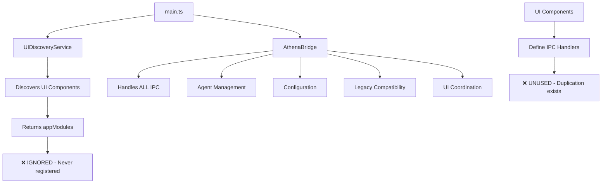

# Architecture Analysis & Improvement Plan

## Executive Summary

This document provides a comprehensive analysis of the Laserfocus Electron application architecture, identifies key issues, and proposes a minimal-impact solution to complete the existing modular design rather than restructuring from scratch.

## Current Architecture Overview

### Project Structure
```
src/
├── main.ts                    # Electron main process entry point
├── core/                      # Core application logic
│   ├── agents/                # AI agents (Athena Agent v4)
│   │   ├── athena-agent-v4.ts # Main conversational agent
│   │   ├── prompts/           # Agent behavioral intelligence
│   │   └── llm/               # LLM provider infrastructure  
│   ├── engine/                # Canvas Engine v4 (agnostic tools)
│   │   ├── canvas-engine-v4.ts # Pure tool provider
│   │   └── adapters/          # Desktop adapter
│   ├── bridge/                # Main process coordination
│   │   ├── athena-bridge-v4.ts # Monolithic IPC handler (425 lines)
│   │   └── types.ts           # App module interfaces
│   ├── config/                # Configuration system
│   └── app-discovery/         # UI component discovery
├── ui/                        # User interface components
│   └── platform/              # Platform UI components
│       ├── InputPill/         # User input interface
│       ├── AthenaWidget/      # Conversation monitor
│       └── Byokwidget/        # API key management
└── lib/                       # Shared libraries and types
```

### Current Data Flow


## Problem Analysis

### 1. **Architectural Issues Identified**

#### **Issue #1: Incomplete Modular Migration**
- **Problem**: UI components define modular IPC handlers but they're never registered
- **Evidence**: `main.ts` collects `appModules` from UIDiscovery but ignores them
- **Impact**: Code duplication, unused infrastructure

#### **Issue #2: Monolithic AthenaBridge**  
- **Problem**: Single class (425 lines) handling everything
- **Responsibilities**: IPC, agents, config, canvas, legacy compatibility, UI coordination
- **Impact**: Violates single responsibility principle, hard to maintain

#### **Issue #3: Code Duplication**
- **Problem**: Byokwidget API key handlers exist in both:
  - `athena-bridge-v4.ts` (lines 250-280)
  - `byokwidget.ipc.ts` (complete implementation)
- **Impact**: Maintenance burden, inconsistency risk

#### **Issue #4: Misleading Naming**
- **Problem**: "AthenaBridge" handles all app coordination, not just Athena
- **Problem**: "bridge/" folder contains main process services
- **Impact**: Semantic confusion, poor discoverability

### 2. **What's Working Well**

#### **✅ Clean Separation of Concerns**
- **Agents**: Pure AI logic with prompts
- **Engine**: Agnostic tool provider (Canvas Engine v4)
- **UI Components**: Self-contained with own IPC definitions

#### **✅ Modular UI System**
- Auto-discovery via `app-registry.ts`
- Each component defines its own main class + IPC handlers
- Clear interfaces (`AppIpcModule`)

#### **✅ Configuration Architecture**
- Hot-reloading configuration system
- Clean provider abstraction
- Environment-based defaults

## Proposed Solution: Complete Existing Architecture

### Strategy: Minimal Impact, Maximum Benefit

Rather than major restructuring, **complete the existing modular design** that was partially implemented.

### Implementation Plan

#### **Phase 1: Connect Modular IPC System (5 lines)**

**File: `src/main.ts`**
```typescript
// After UI Discovery (around line 62)
const { appInstances, appModules } = await uiDiscoveryService.discoverAndInitializeUIComponents();

// ADD: Register modular IPC handlers that were being ignored
appModules.forEach(module => {
    const instance = appInstances.get(module.moduleId);
    if (instance) {
        module.registerMainProcessHandlers(ipcMain, instance, appInstances);
        logger.info(`[main] Registered IPC handlers for ${module.moduleId}`);
    }
});
```

#### **Phase 2: Split AthenaBridge (Reduce 425 → 150 lines)**

**Create: `src/core/main-process/agent-bridge.ts`**
```typescript
/**
 * Agent Bridge - Focused on AI agent coordination
 * Handles only agent lifecycle, chat, and legacy compatibility
 */
export class AgentBridge {
    private athenaAgent: AthenaAgent | null = null;
    
    // Agent management (~100 lines)
    // Chat handling (~30 lines)  
    // Legacy compatibility (~20 lines)
    // Total: ~150 lines (focused scope)
}
```

**Remove from AthenaBridge:**
- Byokwidget API key handlers (already in `byokwidget.ipc.ts`)
- Generic configuration handlers (move to config service)
- UI coordination (handled by modular system)

#### **Phase 3: Semantic Improvements**

**Rename for Clarity:**
```
src/core/bridge/          → src/core/main-process/
athena-bridge-v4.ts      → agent-bridge.ts
AthenaBridge             → AgentBridge
```

**Update imports across codebase:**
```typescript
// Before
import { initializeAthenaBridge } from '@core/bridge/athena-bridge-v4';

// After  
import { initializeAgentBridge } from '@core/main-process/agent-bridge';
```

#### **Phase 4: Clean Up Duplication**

**Remove duplicate handlers:**
- Remove Byokwidget handlers from AgentBridge
- Ensure each UI component owns its IPC completely
- Remove unused legacy compatibility where possible

### Expected Benefits

#### **Immediate Benefits**
- **Code Reduction**: 425 → 150 lines in main coordinator
- **Eliminate Duplication**: Single source of truth for each IPC handler
- **Enable Modular System**: UI components' IPC handlers actually work
- **Better Semantics**: Names match actual functionality

#### **Long-term Benefits**  
- **Easier Extension**: New UI components automatically get IPC registration
- **Maintainability**: Each component owns its behavior
- **Testability**: Focused, single-responsibility services
- **Scalability**: Modular system supports growth

### Risk Assessment

#### **Low Risk Changes**
- ✅ Adding IPC registration (5 lines)
- ✅ Removing duplicate handlers  
- ✅ Renaming for clarity

#### **Medium Risk Changes**
- ⚠️ Splitting AthenaBridge (requires careful testing)
- ⚠️ Import path updates (needs thorough search/replace)

#### **Mitigation Strategies**
- Implement incrementally (one phase at a time)
- Keep legacy compatibility during transition
- Comprehensive testing after each phase
- Feature flags for new vs old system

## Alternative Considered: Major Restructure

### Why We Rejected This Approach

Initially considered breaking into 5+ services:
- `IPCCoordinator` 
- `AgentManager`
- `ConfigService`
- `AppCoordinator`
- `ModuleRegistry`

**Rejected because:**
- ❌ Over-engineered for current needs
- ❌ High implementation risk
- ❌ Ignores good existing architecture
- ❌ Unnecessary complexity

**Current architecture is fundamentally sound** - it just needs completion, not replacement.

## Implementation Timeline

### Week 1: Foundation
- [ ] Phase 1: Connect modular IPC system
- [ ] Test that UI component handlers work
- [ ] Verify no regressions

### Week 2: Refinement  
- [ ] Phase 2: Split AgentBridge
- [ ] Remove code duplication
- [ ] Test agent functionality

### Week 3: Polish
- [ ] Phase 3: Semantic improvements
- [ ] Update documentation
- [ ] Final testing

### Week 4: Verification
- [ ] Integration testing
- [ ] Performance validation
- [ ] Production readiness check

## Success Metrics

### Quantitative Goals
- **Reduce main coordinator size**: 425 → 150 lines (-65%)
- **Eliminate duplication**: 0 duplicate IPC handlers
- **Enable modularity**: 100% of UI component handlers registered
- **Zero regressions**: All existing functionality preserved

### Qualitative Goals
- **Improved maintainability**: Each component owns its behavior
- **Better semantics**: Names accurately reflect functionality  
- **Enhanced extensibility**: New UI components "just work"
- **Cleaner architecture**: Separation of concerns respected

## Conclusion

The Laserfocus architecture is **well-designed but incomplete**. Rather than major restructuring, we should **complete the existing modular vision** with minimal changes:

1. **Connect the modular IPC system** (5 lines)
2. **Focus the agent bridge** (reduce scope)
3. **Improve semantics** (rename for clarity)
4. **Eliminate duplication** (single source of truth)

This approach respects the existing architecture while solving the core issues with minimal risk and maximum benefit.

---

## Appendix: Key Files Analysis

### AthenaBridge Current Responsibilities
- ✅ Agent lifecycle management
- ✅ Chat coordination  
- ✅ Legacy compatibility
- ❌ Byokwidget API keys (duplicated)
- ❌ General configuration (should be modular)
- ❌ UI coordination (should be modular)

### UI Component IPC Status
- **InputPill**: Placeholder handlers (needs activation)
- **Byokwidget**: Complete API key management (unused!)
- **AthenaWidget**: Minimal conversation monitoring (unused!)

### Architectural Principles Validated
- ✅ Canvas Engine v4: Agnostic tool provider
- ✅ Agents: Behavioral intelligence in prompts
- ✅ Configuration: Hot-reloading system
- ✅ UI Discovery: Auto-registration system
- ❌ Modular IPC: Defined but not connected

**The foundation is solid. We just need to finish the construction.**

---

## Conversation Summary

### Key Discussion Points

#### **Initial Question: Why Only One Bridge?**
**User**: "why is the athena bridge the only bridge, and why is there a dedicated type for this? Analyze how we could restructure the project or rename certain key terms to be more semantically useful"

**Initial Assessment**: The "AthenaBridge" has grown beyond its original scope and now handles ALL main process coordination (425 lines), not just Athena-specific functionality.

#### **Architecture Deep Dive**
**User**: "Analyze the entire current architecture of the project and review if your proposal indeed fits best"

**Key Findings**:
- Current architecture is **well-designed but incomplete**
- UI components define modular IPC handlers that are **never registered**
- AthenaBridge has become a **monolithic coordinator** handling everything
- **Code duplication** exists (e.g., Byokwidget handlers in two places)

#### **Original Restructuring Proposal (Rejected)**
Initially proposed breaking AthenaBridge into 5+ services:
- `IPCCoordinator`
- `AgentManager` 
- `ConfigService`
- `AppCoordinator`
- `ModuleRegistry`

**Rejected because**: Over-engineered, ignores good existing architecture

#### **Refined Approach (Adopted)**
Instead of major restructuring: **Complete the existing modular design**
- Connect the modular IPC system (5 lines)
- Split AthenaBridge into focused AgentBridge
- Enable UI components to own their IPC handlers
- Eliminate code duplication

#### **Layout System Context**
Previous conversation included fixing Canvas Engine v4 layout calculations to:
- Use `gemini-2.0-flash-lite` model
- Add detailed tool call logging
- Make windows extend closer to InputPill
- Use real desktop state instead of hardcoded assumptions

This architectural analysis builds on that clean Canvas Engine v4 foundation.

### Decision Rationale

#### **Why Complete vs Restructure?**
1. **Existing architecture is sound** - just incomplete
2. **Modular IPC system already designed** - just not connected
3. **UI components already define handlers** - just unused
4. **Minimal risk approach** - respects existing patterns
5. **Maximum benefit** - enables the intended modular vision

#### **Evidence of Incomplete Migration**
```typescript
// main.ts line 62 - collects but ignores appModules
const { appInstances, appModules } = await uiDiscoveryService.discoverAndInitializeUIComponents();
// appModules never used! 

// byokwidget.ipc.ts - complete API key implementation 
registerMainProcessHandlers: (ipcMain, appInstance) => {
    ipcMain.handle('byokwidget:save-api-key', ...); // Unused!
}

// athena-bridge-v4.ts - duplicate implementation
ipcMain.handle('byokwidget:set-api-key', ...); // Used instead!
```

### Key Insights

1. **Architecture Analysis Required Full Context**: Initial focus on "bridge" naming led to over-engineering proposal
2. **Existing Patterns Are Good**: UI discovery, modular IPC definitions, agent separation
3. **Completion > Revolution**: Sometimes the best solution is finishing what was started
4. **Semantic Naming Matters**: "AthenaBridge" -> "AgentBridge" clarifies purpose
5. **Code Speaks Truth**: Implementation reveals intended but incomplete architecture

### Next Steps Summary

**Phase 1** (5 lines): Connect modular IPC system
**Phase 2** (refactor): Split AthenaBridge -> AgentBridge  
**Phase 3** (rename): Improve semantic clarity
**Phase 4** (cleanup): Eliminate duplication

**Expected Result**: 
- 65% code reduction in main coordinator
- 100% UI component IPC handlers enabled
- 0 duplicate implementations
- Semantically accurate naming

This approach respects the existing good architecture while completing the intended modular vision with minimal risk. 