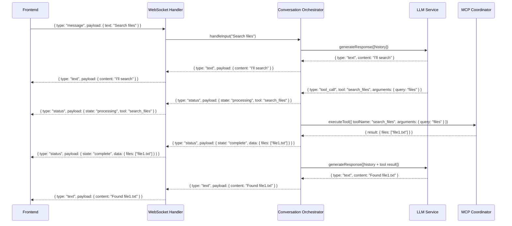
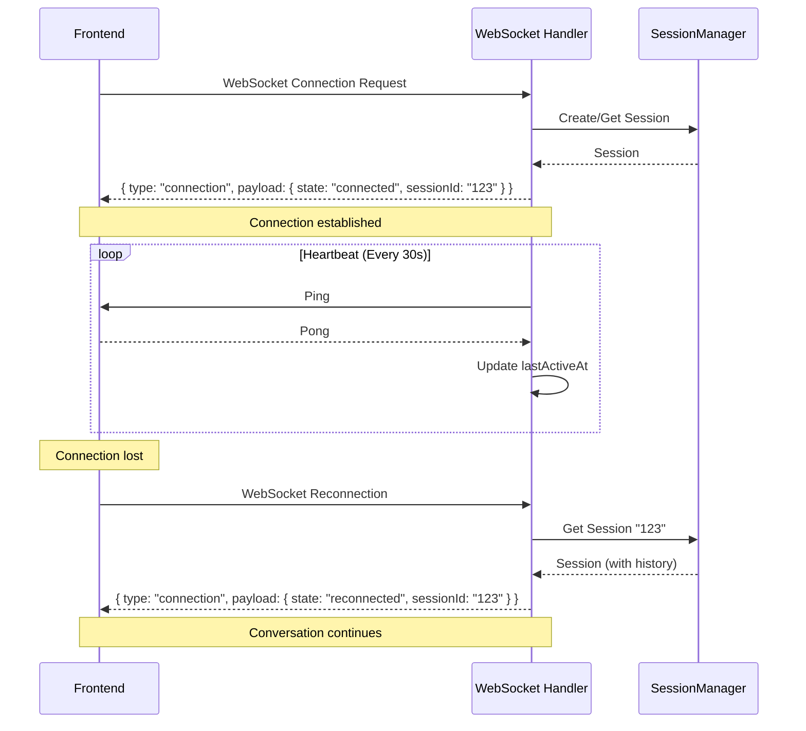

# MCP Host Server: MVP Implementation Specification

## 1. Introduction and Overview

This document provides an architectural specification for the implementation of a Minimum Viable Product (MVP) for the MCP Host Server. Rather than focusing on specific code details, this specification outlines what each component should do, the interfaces between them, and how data flows through the system.

The MCP Host Server enables real-time chat with an LLM (initially Gemini), with seamless integration of tools via the Model Context Protocol (MCP). It uses Node.js with TypeScript, Fastify for WebSocket handling, and the MCP SDK to create a robust, extensible foundation.

## 2. Core System Components

### 2.1 WebSocket Handler

#### Responsibility

Manages bidirectional, real-time communication with frontend clients, including session establishment, message relay, response streaming, and connection health monitoring.

#### Types

```typescript
// Inbound message from frontend client
interface ClientMessage {
  type: "message";
  payload: {
    text: string;
  };
}

// Connection metadata for tracking client state
interface ConnectionMetadata {
  sessionId: string;
  clientId: string; // Unique per connection
  connectedAt: number;
  lastActiveAt: number;
  userAgent?: string; // For debugging client issues
}

// Outbound messages to frontend client
type ServerMessage =
  | {
      type: "text";
      payload: {
        content: string;
      };
    }
  | {
      type: "status";
      payload: {
        state: "processing" | "complete";
        tool?: string;
        message: string;
        data?: object;
      };
    }
  | {
      type: "connection";
      payload: {
        state: "connected" | "reconnecting" | "error";
        message: string;
        sessionId: string;
      };
    };
```

#### Methods

- `setupWebSocket(app: FastifyInstance): void` - Registers WebSocket routes and handlers
- `handleConnection(connection: WebSocket, request: FastifyRequest): void` - Sets up event handlers for a new WebSocket connection
- `sendMessage(connection: WebSocket, message: ServerMessage): void` - Sends a message to a client
- `broadcastMessage(sessionId: string, message: ServerMessage): void` - Sends a message to all clients in a session
- `handleHeartbeat(connection: WebSocket): void` - Process ping/pong for connection health
- `cleanupStaleConnections(): void` - Remove inactive connections
- `getActiveConnections(sessionId?: string): ConnectionMetadata[]` - Get active connections

#### Flow

1. Client establishes WebSocket connection to `/ws` endpoint
2. Handler creates or retrieves a session for this connection
3. Handler sends "connected" message with sessionId
4. Handler sets up heartbeat monitoring
5. Handler listens for messages from client
6. When messages arrive, they're forwarded to the Conversation Orchestrator
7. Responses from the Orchestrator are streamed back to the client
8. Periodically check for and clean up stale connections

### 2.2 Conversation Orchestrator

#### Responsibility

Acts as the central coordinator for the entire chat experience, managing conversation state, delegating to the LLM and tools, and ensuring coherent conversation flow.

#### Types

```typescript
// Core message type for the conversation history
interface ChatMessage {
  id: string; // Unique identifier
  role: "user" | "assistant" | "system" | "tool";
  content?: string; // Text content (for user/assistant/system)
  data?: any; // Structured data (for tool results)
  createdAt: number; // Timestamp
  toolName?: string; // Name of tool if role is "tool"
  kind?: "start" | "progress" | "complete"; // Message phase for tools
  metadata?: Record<string, any>; // Additional message metadata
}

// Configuration for the orchestrator
interface OrchestratorConfig {
  maxHistoryLength: number;
  retryAttempts: number;
  retryDelay: number;
  maxTokenCount?: number; // For context window management
}

// For managing LLM context window size
interface HistoryManagementOptions {
  maxTokenCount: number; // Max tokens to send to LLM
  summarizationThreshold: number; // When to summarize old messages
  retainNewestMessages: number; // Always keep N newest messages
}

// Enhanced error tracking
interface ErrorContext {
  component: string;
  action: string;
  attemptCount: number;
  originalError: Error;
  recoveryAction?: "retry" | "fallback" | "abort";
  timestamp: number;
  sessionId: string;
  requestId: string;
}
```

#### Methods

- `constructor(llmService: LLMService, mcpCoordinator: MCPCoordinator, config: OrchestratorConfig)`
- `async *handleInput(sessionId: string, text: string): AsyncGenerator<ServerMessage>` - Processes user input, yields responses
- `addMessageToHistory(sessionId: string, message: ChatMessage): void` - Adds a message to the conversation history
- `getHistory(sessionId: string): ChatMessage[]` - Retrieves the conversation history
- `async *processToolCall(sessionId: string, toolCall: ToolCallRequest): AsyncGenerator<ServerMessage>` - Processes a tool call
- `pruneHistory(sessionId: string, options?: HistoryManagementOptions): ChatMessage[]` - Manage context window
- `createSystemMessage(content: string, metadata?: object): ChatMessage` - Helper for consistent system messages
- `abortActiveToolExecution(sessionId: string, requestId: string): Promise<boolean>` - Cancel running tool calls
- `handleErrorWithContext(context: ErrorContext): Promise<void>` - Process errors with structured context

#### Flow

1. Receives user input from WebSocket Handler
2. Adds user message to history
3. Prunes history if needed to manage context window
4. Sends history to LLM Service for response generation
5. For text responses: streams to client via WebSocket Handler
6. For tool calls:
   - Parses the tool call JSON
   - Sends "processing" status to client
   - Delegates to MCP Coordinator for execution
   - Adds tool result to history
   - Sends "complete" status with result
   - Re-prompts LLM with the result for follow-up response

#### Error Handling

- Retries LLM calls up to configured limit with delay between attempts
- Logs all errors with structured context (session ID, timestamp, component)
- For unrecoverable errors, sends a user-friendly fallback message
- Detects and mitigates LLM hallucinations (e.g., calling non-existent tools)
- Handles aborted requests cleanly (e.g., client disconnects mid-request)

### 2.3 LLM Service

#### Responsibility

Abstracts interactions with LLM providers, handling prompting, streaming, and parsing of tool call intents.

#### Types

```typescript
// Interface for LLM providers (Gemini, OpenAI, etc.)
interface LLMService {
  initialize(config: LLMConfig): Promise<void>;
  async *generateResponse(
    history: ChatMessage[],
    options?: GenerationOptions
  ): AsyncGenerator<LLMResponse>;
}

// Response from an LLM, either text or a tool call
type LLMResponse =
  | { type: "text"; content: string; }
  | {
      type: "tool_call";
      tool: string;
      arguments: object;
    };

// Configuration for LLM
interface LLMConfig {
  apiKey: string;
  model: string;
  temperature: number;
  systemPrompt: string;
  maxRetries: number;
  timeoutMs: number;
}

// For token management
interface TokenUsage {
  promptTokens: number;
  completionTokens: number;
  totalTokens: number;
}

// For streaming control
interface GenerationOptions {
  maxTokens?: number;
  timeoutMs?: number;
  abortSignal?: AbortSignal;
  requestId?: string;
}

// Error type for LLM failures
class LLMServiceError extends Error {
  constructor(
    message: string,
    public readonly cause: Error,
    public readonly context: {
      model: string;
      promptTokens?: number;
      attemptCount: number;
    }
  ) {
    super(message);
  }
}
```

#### Methods

- `constructor(config: LLMConfig)`
- `async *generateResponse(history: ChatMessage[], options?: GenerationOptions): AsyncGenerator<LLMResponse>` - Generates LLM responses
- `formatHistoryForLLM(history: ChatMessage[]): FormattedHistory` - Prepares history for LLM consumption
- `parseToolCall(text: string): ToolCallRequest | null` - Attempts to parse a tool call JSON blob
- `estimateTokenCount(text: string): number` - Approximate token count for context management
- `createToolPrompt(tools: ToolDefinition[]): string` - Generate consistent tool description prompts
- `abortGeneration(requestId: string): boolean` - Cancel an in-progress generation
- `getTokenUsage(sessionId: string): TokenUsage | null` - Get token usage for billing/monitoring

#### Flow

1. Receives conversation history from Orchestrator
2. Formats history according to the LLM's expected input format
3. Estimates token count to verify within limits
4. Prompts LLM with appropriate system instructions for tool use
5. Streams response chunks, parsing them as either:
   - Text content to pass directly to the client
   - Tool call JSON to pass to the Orchestrator for execution
6. Handles timeouts or client cancellations

#### Prompt Engineering for Tools

- Includes a clear list of available tools and their parameters in the system prompt
- Instructs the LLM to output tool calls as JSON blobs: `{ "tool": "name", "arguments": {...} }`
- Prompts the LLM to maintain a coherent narrative around tool calls
- Provides error handling guidance to help the LLM respond to tool failures

### 2.4 MCP Coordinator

#### Responsibility

Manages connections to MCP servers, discovers tools, and handles tool execution requests.

#### Types

```typescript
// Configuration for an MCP server from mcp.json
interface ServerConfig {
  id: string;
  type: "local" | "remote";
  transport: "stdio" | "http";
  command?: string; // For stdio transport
  args?: string[]; // For stdio transport
  url?: string; // For http transport
  timeoutMs?: number; // Tool execution timeout
}

// Tool call request
interface ToolCallRequest {
  toolName: string;
  arguments: object;
  requestId: string;
  timeoutMs?: number; // Per-call timeout
}

// Tool call response
interface ToolCallResponse {
  toolName: string;
  result: any;
  error?: {
    code: number;
    message: string;
  };
  requestId: string;
  executionTimeMs: number; // How long the call took
}

// Tool definition from the MCP server
interface ToolDefinition {
  name: string;
  description: string;
  parameters: object;
  serverId: string; // Which server provides this tool
}

// Tool metadata for better management
interface ToolMetadata {
  serverId: string;
  transportType: "stdio" | "http";
  avgResponseTimeMs?: number; // For monitoring
  failureCount?: number; // For reliability tracking
  lastUsed?: number; // For potential cleanup
}

// Request options
interface ToolExecutionOptions {
  timeoutMs?: number;
  priority?: "high" | "normal" | "low";
  retryOptions?: {
    maxRetries: number;
    delayMs: number;
    retryableErrorCodes: number[];
  };
}

// Error type for tool failures
class ToolExecutionError extends Error {
  constructor(
    message: string,
    public readonly cause: Error,
    public readonly context: {
      toolName: string;
      serverId: string;
      requestId: string;
      arguments: object;
    }
  ) {
    super(message);
  }
}
```

#### Methods

- `constructor(configPath: string)`
- `initialize(): Promise<void>` - Loads configuration and connects to servers
- `getAvailableTools(): ToolDefinition[]` - Returns the list of all available tools
- `executeTool(request: ToolCallRequest, options?: ToolExecutionOptions): Promise<ToolCallResponse>` - Executes a tool
- `shutdown(): Promise<void>` - Gracefully shuts down all MCP clients
- `validateToolArguments(toolName: string, args: object): boolean` - Verify args match tool schema
- `getToolMetadata(toolName: string): ToolMetadata | null` - Get info about a specific tool
- `abortToolExecution(requestId: string): Promise<boolean>` - Cancel running tool call
- `reloadToolConfiguration(): Promise<void>` - Refresh tool config without restart
- `trackToolReliability(toolName: string, success: boolean, error?: Error): void` - Monitor tool reliability

#### Flow

1. On initialization, reads mcp.json to identify MCP servers
2. Creates an MCP client for each server using the appropriate transport
3. Calls tools/list on each client to discover available tools
4. Builds a registry mapping tools to their owning clients
5. When executeTool is called:
   - Validates the tool arguments against the schema
   - Looks up the appropriate client for the requested tool
   - Constructs a tools/call JSON-RPC request
   - Sets up timeout handling
   - Sends the request to the client
   - Handles response/errors and returns a ToolCallResponse
   - Tracks tool reliability for potential circuit breaking

#### Error Handling

- Validates mcp.json schema on startup
- Implements retry logic for transient tool failures
- Logs detailed diagnostics for tool call failures
- Gracefully handles server disconnections
- Implements timeouts for unresponsive tools
- Tracks tool reliability to identify problematic servers

### 2.5 Cross-Cutting Concerns

#### Session Management

```typescript
interface SessionManager {
  createSession(metadata?: object): string;
  getSession(sessionId: string): Session | null;
  addConnectionToSession(sessionId: string, connectionId: string): void;
  removeConnectionFromSession(sessionId: string, connectionId: string): void;
  getAllSessions(): Session[];
  cleanupInactiveSessions(maxAgeMs: number): void;
}

interface Session {
  id: string;
  createdAt: number;
  lastActiveAt: number;
  connections: string[]; // Connection IDs
  history: ChatMessage[];
  metadata: object;
}
```

#### Request Correlation and Tracing

```typescript
interface RequestContext {
  requestId: string;
  sessionId: string;
  parentRequestId?: string;
  startTime: number;
  traceId: string;
  labels: Record<string, string>;
}
```

#### Standard System Messages

```typescript
const SYSTEM_MESSAGES = {
  WELCOME:
    "Hello! I'm an AI assistant that can help answer questions and use tools to get information.",
  TOOL_ERROR: (toolName: string, error: string) =>
    `I encountered an error when using the ${toolName} tool: ${error}. Let me try a different approach.`,
  RATE_LIMITED:
    "I'm currently processing too many requests. Please try again in a moment.",
  MAINTENANCE:
    "The system is currently undergoing maintenance. Some features may be unavailable.",
};
```

## 3. Implementation Phases

### Phase 1: Project Setup and Core Type Definitions

- Initialize Node.js project with TypeScript
- Configure ESLint, Prettier, Jest
- Set up directory structure
- Add core dependencies:
  - fastify, @fastify/websocket
  - @modelcontextprotocol/sdk
  - @google/generative-ai (for Gemini)
  - zod (for validation)
  - dotenv (for environment variables)
  - pino (for logging)
- Implement all interface and type definitions
- Create validation schemas using Zod
- Set up error classes and request context types
- Set up the session management interface
- Implement standard system messages

### Phase 2: MCP Coordinator Implementation

- Implement configuration loading and validation
- Create client initialization logic
- Implement tool discovery
- Add tool execution and error handling
- Implement timeout and cancellation logic
- Add tool validation using schemas from tools/list
- Build tool reliability tracking
- Add structured error handling with ToolExecutionError
- Build unit tests with mocked MCP clients

### Phase 3: LLM Service Implementation

- Create base LLM service interface
- Implement Gemini adapter
- Add token counting and context management
- Add prompting and tool parsing logic
- Implement streaming response handling
- Add timeout and cancellation support
- Build structured error handling with LLMServiceError
- Add unit tests with mocked LLM responses

### Phase 4: Session Management Implementation

- Implement SessionManager interface
- Add session creation and retrieval
- Build connection tracking per session
- Implement session cleanup for stale sessions
- Add unit tests for session management

### Phase 5: Conversation Orchestrator Implementation

- Integrate with Session Manager
- Implement message history tracking
- Add context window management with pruneHistory
- Build the main processing loop for user inputs
- Implement tool call handling
- Add error recovery and structured logging
- Implement abort/cancellation handling
- Add unit tests for orchestration flow

### Phase 6: WebSocket Handler Implementation

- Set up Fastify with WebSocket plugin
- Implement connection handler
- Add connection health monitoring (heartbeats)
- Build message routing logic
- Implement response streaming
- Add session tracking for multiple connections
- Add connection cleanup for stale connections
- Build integration tests for the WebSocket interface

### Phase 7: Integration and E2E Testing

- Connect all components
- Implement request context propagation
- Create end-to-end test scenarios
- Test with real LLM and MCP servers
- Verify error handling paths
- Test connection resilience
- Test tool execution with timeouts
- Measure performance characteristics

## 4. Logging and Observability

### 4.1 Logging Strategy

- Use structured logging with Pino
- Include consistent fields in all logs:
  - sessionId
  - requestId
  - component (WebSocket, Orchestrator, LLM, MCP)
  - action (e.g., "message_received", "tool_execution_start")
  - timestamp
  - correlationId (to track request flow)
- Log levels:
  - trace: Fine-grained debugging
  - debug: Development information
  - info: Regular operation events
  - warn: Concerning but non-fatal issues
  - error: Failures requiring attention

### 4.2 Key Logging Points

- WebSocket connections and disconnections
- Connection heartbeats and health checks
- Message receipt and sending
- LLM prompting and response parsing
- Token usage and context window management
- Tool call requests and responses
- Tool reliability tracking
- Error conditions and retry attempts
- Configuration loading
- Session creation and cleanup

## 5. Error Handling Strategy

### 5.1 Error Categories

- **Transient Errors**: Temporary failures like network issues, rate limits
  - Strategy: Retry with backoff, log attempts
- **Persistent Errors**: Consistent failures like invalid credentials, bad configuration
  - Strategy: Fail fast, log detailed diagnostics, provide clear user message
- **Degraded Operation**: When some functionality works but other parts fail
  - Strategy: Continue with available functionality, notify user of limitations
- **Timeout Errors**: Operations taking too long
  - Strategy: Cancel operation, inform user, log performance metrics

### 5.2 Error Recovery Flows

- **LLM Failures**:
  - Retry up to 3 times with 1-second delay
  - Fall back to a pre-defined response if all retries fail
  - Log the failure with prompt and error details
  - Propagate structured LLMServiceError for analysis
- **Tool Execution Failures**:
  - Retry once for transient errors
  - Add error information to conversation history
  - Re-prompt LLM to handle the failure gracefully
  - Track tool reliability to identify problematic tools
  - Propagate structured ToolExecutionError for analysis
- **WebSocket Failures**:
  - Maintain session state for reconnection
  - Provide reconnection instructions to the client
  - Use heartbeats to detect zombie connections
  - Clean up resources if reconnection times out
- **Context Window Overflow**:
  - Detect before sending to LLM
  - Prune history according to strategy
  - Log token counts for monitoring

## 6. Security Considerations

### 6.1 Input Validation

- Validate all incoming messages with Zod schemas
- Sanitize user input before passing to LLM
- Verify tool call arguments match expected schemas
- Implement timeouts on all external operations

### 6.2 API Keys and Secrets

- Store all sensitive values in environment variables
- Never expose API keys to the frontend
- Log sanitized requests (no credentials)
- Rotate keys regularly (document process)

### 6.3 Tool Permission Scope

- Implement basic allowlisting for tools
- Validate tool arguments to prevent abuse
- Consider request rate limiting for tools
- Monitor tool usage patterns for anomalies

## 7. Deployment and DevOps

### 7.1 Development Environment

- Docker Compose setup with example MCP servers
- Environment variable templates
- Watch mode for rapid development
- Logging configuration for development

### 7.2 Testing Strategy

- Unit tests for each component
- Integration tests for component pairs
- End-to-end tests for full system
- Mock servers for MCP and LLM testing
- Stress tests for connection handling
- Chaos testing for error recovery

### 7.3 Release Process

- Version control with Git
- Semantic versioning
- Automated CI/CD with GitHub Actions
- Containerized deployment
- Automated testing before deployment

## 8. Future Considerations

### 8.1 Performance Optimization

- Implement caching for repeated tool calls
- Add context pruning for long conversations
- Consider parallel tool execution for independent tools
- Pool LLM connections for efficiency

### 8.2 Scaling Beyond MVP

- Add persistent storage for conversation history
- Implement session management across server restarts
- Consider distributed architecture for horizontal scaling
- Implement proper connection draining for graceful restarts

### 8.3 Feature Expansion

- Support additional LLM providers
- Add authentication and multi-user support
- Implement more advanced error recovery strategies
- Add tool execution analytics

## 9. Technical Constraints and Standards

### 9.1 Node.js Version

- Require Node.js 18+ for native fetch support
- Use ESM modules for imports
- Leverage async context features

### 9.2 TypeScript Standards

- Strict type checking enabled
- Explicit return types on public methods
- Properly typed async generators
- No implicit any types

### 9.3 Code Style

- Follow AirBnB style guide
- Use prettier for formatting
- Document all public interfaces with JSDoc
- Max line length of 100 characters

## 10. Appendix

### 10.1 Example Sequence Diagrams

#### User Message Processing



#### Connection Management



### 10.2 Example Config Files

#### mcp.json

```json
{
  "servers": {
    "filesystem": {
      "id": "filesystem",
      "type": "local",
      "transport": "stdio",
      "command": "npx",
      "args": ["@modelcontextprotocol/server-filesystem"],
      "timeoutMs": 10000
    },
    "github": {
      "id": "github",
      "type": "remote",
      "transport": "http",
      "url": "http://github-mcp.example.com",
      "timeoutMs": 15000
    }
  }
}
```

#### .env

```
GEMINI_API_KEY=your_api_key_here
MCP_JSON_PATH=./mcp.json
LOG_LEVEL=info
PORT=3000
MAX_TOKEN_COUNT=8192
DEFAULT_TOOL_TIMEOUT_MS=5000
```

### 10.3 Tool Reliability Circuit Breaker

The system implements a simple circuit breaker pattern for unreliable tools:

```typescript
// Implementation concept
class ToolCircuitBreaker {
  private failures: Record<string, { count: number; lastFailure: number }> = {};
  private readonly threshold = 5;
  private readonly resetTimeMs = 60000; // 1 minute

  recordFailure(toolName: string): void {
    if (!this.failures[toolName]) {
      this.failures[toolName] = { count: 0, lastFailure: 0 };
    }
    this.failures[toolName].count++;
    this.failures[toolName].lastFailure = Date.now();
  }

  recordSuccess(toolName: string): void {
    if (this.failures[toolName]) {
      this.failures[toolName].count = Math.max(
        0,
        this.failures[toolName].count - 1
      );
    }
  }

  isOpen(toolName: string): boolean {
    const failure = this.failures[toolName];
    if (!failure) return false;

    // Reset if threshold time has passed
    if (Date.now() - failure.lastFailure > this.resetTimeMs) {
      failure.count = 0;
      return false;
    }

    return failure.count >= this.threshold;
  }
}
```
